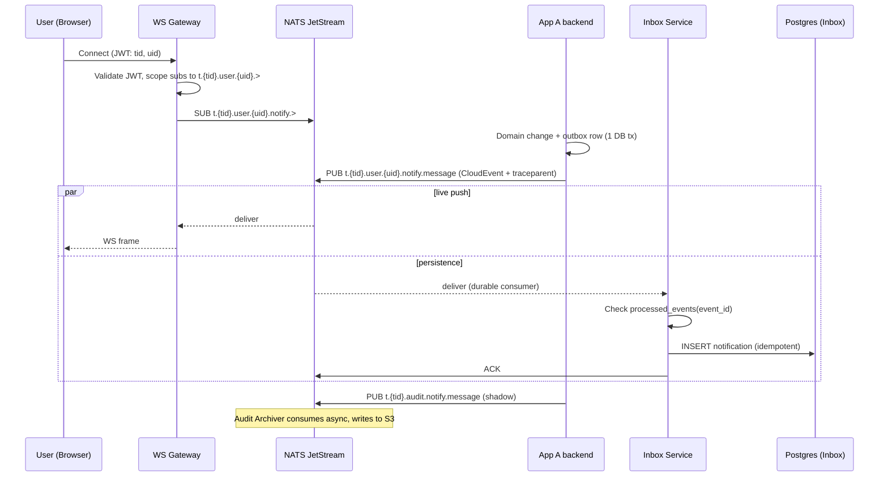
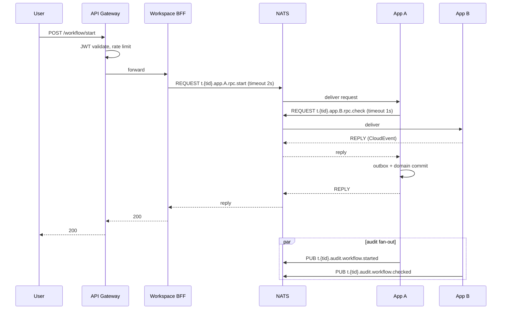
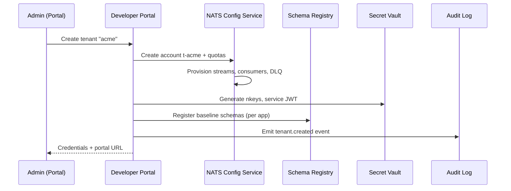

# Workspace Platform — Production-Ready Architecture Review

> Review of `prd/core.md` against industrial practice for multi-tenant SaaS event-driven platforms. Companion to `prd/architecture_suggestions.md` (extends, does not replace).

---

## 1. Executive Summary

The PRD lands a strong core idea: an event-driven workspace built on NATS JetStream, where apps don't expose backends to the internet and a unified notification flow ties cross-app activity together. That foundation is sound and matches industrial practice for event-driven SaaS platforms.

Three risks will block production at the stated scale (200k users, 500 peak RPS, 10M events/day) and especially under the confirmed multi-tenant SaaS model:

1. **Raw clients connecting to JetStream.** Browsers cannot be trusted to enforce per-user/per-tenant authorization, fan-out limits, or input shape. A WebSocket gateway in front of NATS is mandatory.
2. **Centralized cross-app validation as a single stateful service.** The PRD's instinct to validate centrally is *correct* — validation must be server-side and authoritative because third-party app partners may use raw NATS clients, unsupported SDK languages, or buggy integrations. The fix is to implement validation as a **stateless validator pool** sitting on an `ingress.*` subject tier, horizontally scaled, with NATS auth enforcing that only the validator can publish to validated subjects. This keeps the enforcement guarantee while removing the SPOF.
3. **No multi-tenant isolation story.** With multiple customer orgs sharing the platform, NATS Accounts (one per tenant), per-tenant subject prefixing, per-tenant quotas, and per-tenant audit retention all become first-class concerns.

The four highest-leverage additions to make this production-ready:

1. **WebSocket / SSE Gateway** terminating user sessions and bridging to NATS subjects with tenant scoping.
2. **Schema Registry + server-side Validator Pool** on a two-tier `ingress.*` → validated subject scheme, enforced by NATS publish permissions. SDK validates locally as a fast-feedback courtesy; the broker tier is authoritative.
3. **NATS Accounts per tenant**, with `import`/`export` declarations as the only path for cross-tenant flow.
4. **Audit Archiver** streaming JetStream → S3+Parquet (or ClickHouse) for multi-year compliance retention.

The rest of this document is the rubric, math, critique, and concrete refinements that get from the PRD to a buildable design.

### 1.1 System architecture diagram

A single end-to-end view of the recommended target architecture. Renders inline in any Mermaid-aware browser/markdown viewer (GitHub, VS Code preview, Obsidian, etc.). Sequence-level views for specific flows are in §7.

```mermaid
flowchart TB
  classDef edge fill:#e8f1ff,stroke:#3a6cb6,color:#0b2545
  classDef platform fill:#f3eaff,stroke:#7e57c2,color:#311b6b
  classDef nats fill:#fff4e0,stroke:#d49a36,color:#5a3a00
  classDef tenant fill:#eaf6ec,stroke:#3f9b4f,color:#1b4022
  classDef store fill:#fbeaea,stroke:#c0504d,color:#5a1414
  classDef obs fill:#eaf6f6,stroke:#3a8d8d,color:#0f3a3a
  classDef ext fill:#f5f5f5,stroke:#888,color:#222

  subgraph BROWSERS["End-user browsers + Developer browsers"]
    direction LR
    EU["End user UI<br/>(micro-frontends, WS client)"]:::ext
    DEV["Developer Portal UI"]:::ext
  end

  subgraph EDGE["Edge / Internet-facing"]
    direction LR
    LB["Load Balancer<br/>(TLS terminate)"]:::edge
    APIGW["API Gateway<br/>REST + GraphQL<br/>(Envoy + Apollo)"]:::edge
    WSGW["WS / SSE Gateway<br/>(Go, JWT-scoped)"]:::edge
  end

  subgraph IAM["Identity & Authorization"]
    direction LR
    IDP["IdP<br/>(Keycloak / Auth0)"]:::edge
    FGA["OpenFGA<br/>Authorization"]:::edge
  end

  subgraph WORKSPACE["Workspace platform services (WORKSPACE NATS account)"]
    direction LR
    VAL["Validator Pool<br/>stateless, queue group<br/>ingress.* → t.* + DLQ"]:::platform
    BFF["Workspace BFF<br/>(sync orchestration)"]:::platform
    POL["Policy Service<br/>cross-app/cross-tenant ACL"]:::platform
    INBOX["Inbox Service<br/>(CQRS: events to state)"]:::platform
    ARCH["Audit Archiver"]:::platform
    SR["Schema Registry<br/>(Apicurio)"]:::platform
    PORTAL["Developer Portal<br/>(app reg, creds, schemas)"]:::platform
  end

  subgraph NATS["NATS JetStream cluster — 5 nodes, R3, multi-AZ"]
    direction TB
    SYS["SYS account<br/>(ops)"]:::nats
    WSACC["WORKSPACE account<br/>(platform services)"]:::nats
    subgraph TENANTS["Per-tenant accounts (hard isolation)"]
      direction LR
      T1["t-acme account<br/>ingress.* (partners PUB)<br/>t.* (validator-only PUB)<br/>dlq.schema/process, audit, global"]:::tenant
      T2["t-globex account<br/>ingress.* + t.* tiers<br/>per-tenant streams"]:::tenant
      TN["t-{N} …"]:::tenant
    end
  end

  subgraph APPS_T1["App backends — tenant acme (no internet ingress)"]
    direction LR
    A1["App A backend<br/>+ outbox + idempotent consumer"]:::tenant
    A2["App B backend<br/>+ outbox + idempotent consumer"]:::tenant
  end

  subgraph APPS_T2["App backends — tenant globex"]
    direction LR
    B1["App A backend"]:::tenant
    B2["App C backend"]:::tenant
  end

  subgraph STORES["State stores"]
    direction LR
    PG[("PostgreSQL<br/>Inbox<br/>partitioned by tenant_id")]:::store
    REDIS[("Redis<br/>unread_count, hot cache")]:::store
    S3[("S3<br/>audit cold tier<br/>Parquet, per-tenant prefix")]:::store
    CH[("ClickHouse / Athena<br/>audit query")]:::store
    APPDB[("Per-app domain DB<br/>(outbox table inside)")]:::store
  end

  subgraph OBS["Observability"]
    direction LR
    OTEL["OTel Collector"]:::obs
    PROM["Prometheus"]:::obs
    TEMPO["Tempo"]:::obs
    LOKI["Loki"]:::obs
    GRAF["Grafana<br/>(SLO dashboards)"]:::obs
  end

  EU -->|HTTPS / WSS| LB
  DEV -->|HTTPS| LB
  LB --> APIGW
  LB --> WSGW
  LB --> PORTAL

  APIGW -->|verify JWT| IDP
  WSGW -->|verify JWT| IDP
  APIGW -->|Check perms| FGA
  A1 & A2 & B1 & B2 -->|Check perms| FGA
  
  APIGW --> BFF
  BFF -->|NATS request/reply| WSACC
  WSGW -->|sub t.tid.user.uid.notify.*| WSACC

  WSACC <-.->|import ingress.* + audit<br/>+ global + user notify| TENANTS

  A1 -->|PUB ingress.t.acme.*| T1
  A2 -->|PUB ingress.t.acme.*| T1
  T1 -.->|SUB t.acme.app.*| A1
  T1 -.->|SUB t.acme.app.*| A2
  B1 -->|PUB ingress.t.globex.*| T2
  B2 -->|PUB ingress.t.globex.*| T2
  T2 -.->|SUB t.globex.app.*| B1
  T2 -.->|SUB t.globex.app.*| B2

  T1 ==>|ingress feed<br/>queue group| VAL
  T2 ==>|ingress feed| VAL
  VAL ==>|PUB validated t.*<br/>or dlq.schema.*| T1
  VAL ==>|PUB validated t.*| T2

  WSACC --> INBOX
  WSACC --> ARCH
  WSACC --> POL

  INBOX --> PG
  INBOX --> REDIS
  ARCH --> S3
  S3 --> CH
  A1 & A2 & B1 & B2 --> APPDB

  PORTAL --> SR
  PORTAL --> SYS
  A1 & A2 & B1 & B2 -->|fetch + validate schemas| SR
  BFF -->|fetch schemas| SR

  APIGW & WSGW & BFF & POL & INBOX & ARCH -.->|traces, metrics, logs| OTEL
  A1 & A2 & B1 & B2 -.-> OTEL
  OTEL --> PROM
  OTEL --> TEMPO
  OTEL --> LOKI
  PROM & TEMPO & LOKI --> GRAF
```



**How to read it.**

- **Top band** = anything reachable from the public internet. Only the Load Balancer, API Gateway, WS Gateway, IdP login, and Developer Portal sit there. Apps and NATS do not.
- **Middle band (NATS cluster)** = the spine. It is segmented into hard-isolated accounts: `SYS` for ops, `WORKSPACE` for platform services, and one account per tenant. Cross-account flow happens only via explicit `import`/`export` declarations: `ingress.>` (consumed by the Validator Pool), `audit.>` (mirrored to the archiver), `global.>` (observed by the Policy Service), and `user.{uid}.notify.>` (consumed by the Inbox).
- **Validator Pool (the heavy edges)** = the only principal allowed to `publish` on validated subjects (`t.{tid}.app.{aid}.*`). Partner apps publish only to `ingress.t.{tid}.…`; the validator drains ingress as a NATS queue group, schema-validates, and republishes to the validated subject (or `dlq.schema.*` on failure). Stateless and horizontally scaled — failure of one replica is invisible. Enforcement is in NATS auth, not honor.
- **Tenant bands** = app backends, one set per tenant, with no internet ingress. They publish only to `ingress.*` and subscribe only to validated `t.*` (plus calling OpenFGA for authorization).
- **State stores band** = where queryable state lives. NATS holds events in flight; Postgres/Redis hold inbox materialized views; S3 + ClickHouse/Athena hold long-term audit. Each app has its own domain DB containing the transactional outbox.
- **Observability band** = side-channel. Every gateway and every app pushes traces, metrics, and logs to the OTel collector; nothing on the user request path depends on observability being healthy.

**Latency-critical path (cross-app notification, end-to-end):** browser → LB → WS Gateway → app A backend → NATS `ingress.*` → Validator Pool → NATS `t.*` (validated) → fan-out (WS Gateway live + Inbox persistent) → browser. Designed against the §3.8 budget (~350 ms P99 with the validator hop, ~150 ms headroom).

**Multi-tenancy + validation enforcement points:**
1. WS Gateway and API Gateway: reject any subscribe/publish whose subject prefix does not match the JWT's `tenant_id` claim.
2. NATS account boundary: hard isolation; no implicit cross-tenant flow.
3. **NATS publish permissions**: partner apps can `publish` only on `ingress.t.{tid}.…`; the Validator Pool is the *only* principal with `publish` rights on validated `t.{tid}.app.{aid}.*`. Bypassing the validator is impossible at the protocol level — it does not depend on the partner using the SDK.
4. OpenFGA: tenant is the topmost relation; per-app permissions live under it.
5. Audit Archiver: per-tenant prefix in S3, per-tenant retention/deletion policy.

---

## 2. Requirements & Estimations Recap

### 2.1 Personas and capabilities (from `prd/core.md`)

| Persona | Capability | Source | Implication |
|---|---|---|---|
| End user | View/update cross-app data in one platform | `core.md` §High-Level Requirements | Sync read paths, unified UI |
| End user | Unified interaction flow (inbox/notification center) | `core.md` §High-Level Requirements | Event fan-in + read API |
| End user | Permission-scoped data access | `core.md` §High-Level Requirements | AuthN + per-resource AuthZ |
| Developer | Onboard apps to the platform | `core.md` §High-Level Requirements | Developer portal |
| Developer | Unified build interface (SDK/tooling) | `core.md` §High-Level Requirements | First-class SDKs |
| Developer | Unified app-to-app interaction | `core.md` §High-Level Requirements | Event/RPC contract |
| Developer | Monitoring/audit of all events and actions | `core.md` §High-Level Requirements | Audit pipeline |
| Developer | App-to-app notification triggering | `core.md` §High-Level Requirements | Pub/sub semantics |

### 2.2 Estimations and SLOs (verbatim)

| Metric | Value |
|---|---|
| Users | 200,000 |
| End-user requests | 6M / day |
| Peak RPS | 500 |
| Apps | 20 |
| App events | 10M / day |
| Event durability | No loss |
| Event latency | < 500 ms |

### 2.3 Tenancy assumption (confirmed during planning)

**Multi-tenant SaaS** — multiple customer organizations share the platform. The 200k users / 20 apps / 10M events figures are interpreted as platform-wide totals across tenants. Per-tenant rates are highly skewed (top tenants will dominate); architecture must account for that.

---

## 3. Capacity Math

The PRD gives totals but does not work them into infrastructure sizing. Below is a back-of-envelope derivation; numbers are meant to be challenged, not adopted.

### 3.1 Request load (HTTP / sync)

- 6M req/day ÷ 86,400 s ≈ **70 RPS average**.
- Stated peak: **500 RPS**. Peak/avg ≈ 7×, consistent with daytime concentration in B2B SaaS.
- Engineering safety factor 2–3× for spikes, retries, deploys → **size for ~1,500 RPS sustained at the edge**.
- API Gateway: 2 pods (4 vCPU / 8 GB) with HPA; a single Envoy/Apollo Router pod handles 1k+ RPS comfortably.

### 3.2 Event load (async over NATS)

- 10M events/day ÷ 86,400 ≈ **115 events/sec average**.
- Peak/avg of 5–10× (events bunch around user activity windows) → **600–1,200 events/sec sustained, ~2k/sec burst**.
- NATS JetStream on modest hardware does tens of thousands of msg/sec per node; throughput is not the bottleneck. Sizing is dominated by **storage + replication**, not throughput.

### 3.3 JetStream storage

- Avg event size assumed 1 KB (CloudEvent envelope + payload). Validate with prototypes.
- 10M × 1 KB ≈ **10 GB/day raw**.
- 30-day retention: 300 GB.
- R3 replication: ~900 GB across the cluster.
- Plus per-tenant audit mirror (§6.8) on the cluster short-term: budget another 30%.
- Headroom 2× → **provision ~1.8 TB cluster-wide on NVMe**.

→ **5-node JetStream cluster, NVMe-backed, R3 streams**. Five gives headroom for one node down + one node draining during a rolling upgrade.

### 3.4 WebSocket fan-out

- 200k users × ~10% concurrent online = **~20k concurrent WS connections** at peak.
- A well-tuned Go WS server handles 10–20k connections per pod (memory-bound, not CPU). Node/Bun similar.
- → **2–4 WS Gateway pods minimum**, scaled by *connection count* metric, not RPS.
- Sticky sessions not required if subscription state is reconstructed on reconnect from a JetStream durable consumer.

### 3.5 Inbox database

- Assumption: 50 notifications/user/day average, 90-day retention.
- 50 × 200,000 × 90 × 500 B ≈ **450 GB**.
- PostgreSQL with declarative partitioning by `tenant_id` and sub-partition by `created_at` month. Hot-path index on `(user_id, read_at IS NULL)`.
- Read load: 70 RPS edge × ~30% inbox-related = ~20 RPS for list/unread-count. Trivial; cache `unread_count` in Redis with invalidation on event arrival.

### 3.6 Audit cold store

- 10M events/day × 1 KB × 365 days ≈ **3.6 TB/year**.
- Parquet compression typically 5–10×: **~400–700 GB/year on disk** in S3.
- Query layer: ClickHouse self-hosted or Athena (managed). Athena is cheaper to operate at this volume; ClickHouse is faster for ad-hoc per-tenant exploration in the developer portal.

### 3.7 Multi-tenant noisy-neighbor budget

- Assume top tenant is ≤ 30% of platform load → cap any single tenant at **150 RPS / 600 events/sec / 100 GB stream / 50 consumers**.
- Enforce at the NATS Account level (storage, msg rate) and at WS Gateway / SDK (request rate).

### 3.8 Latency budget for the <500 ms SLO

Two paths, depending on whether the event is a partner-originated cross-app publish (must traverse the validator pool) or a workspace-internal event.

**Cross-app event from a partner app (typical end-to-end):**

| Hop | Budget |
|---|---|
| Client → WS/API Gateway | 50 ms |
| Gateway authn/authz | 10 ms |
| Partner app → NATS `ingress.…` publish + JetStream commit (R3 fsync) | 30 ms |
| Validator pool consume + schema check (cached) + republish to `t.…` | 10 ms |
| NATS deliver to consumer | 20 ms |
| Consumer business logic | 100 ms |
| Outbox flush + ack | 30 ms |
| Cross-app fan-out hop (if any) | + 50 ms |
| WS push back to user | 50 ms |
| **Total typical** | **~350 ms P99** |
| Headroom | ~150 ms |

**Workspace-internal event (no validator hop, e.g., user notification from an internal service that bypasses ingress):**

| Hop | Budget |
|---|---|
| Client → WS/API Gateway | 50 ms |
| Gateway authn/authz | 10 ms |
| NATS publish + JetStream commit (R3 fsync) | 30 ms |
| NATS deliver to consumer | 20 ms |
| Consumer business logic | 100 ms |
| Outbox flush + ack | 30 ms |
| WS push back to user | 50 ms |
| **Total typical** | **~290 ms P99** |
| Headroom | ~210 ms |

Both paths fit. The validator hop is +10 ms (cached schema lookup + JSON Schema/Protobuf validate + NATS republish). It is the price of unbypassable server-side validation, and it is bounded — no application logic, no external calls. Consumer business logic and any synchronous external API call inside a consumer remain the dominant variables and must be hop-counted explicitly during design.

---

## 4. Critique of the Six PRD Ideas

### Idea 1 — NATS JetStream as the comm layer between apps, web client, and web server

**What's right.** Centralizing on a single durable broker simplifies the mental model, enables real-time push, and unlocks audit/monitoring as a side-effect of every message flowing through the same pipe.

**What breaks.** Browsers connecting *directly* to JetStream over WebSocket is risky in production:
- Per-message authorization (this user can subscribe to *that* subject only) requires fine-grained NATS auth; doable but operationally complex and brittle as ACLs grow.
- Browsers can be hostile (compromised tokens, malicious extensions). NATS is designed to trust authenticated publishers at the protocol level — it's not the place for input validation, abuse rate limiting, or content filtering.
- Querying ("give me my unread notifications") is not what NATS does. You'd recreate a database in subjects, badly.

**Fix.** Insert a **WebSocket / SSE Gateway**. It terminates the user session, validates JWT, enforces tenant + user scoping, and proxies *only the subscribes/publishes the user is allowed to make* to NATS. NATS lives behind the firewall; the gateway is the only thing internet-reachable on this path. Standard pattern; reference designs published by Synadia and others.

### Idea 2 — Event-driven core; events fanned out by NATS to interested apps

**What's right.** This is the orthodox event-driven backbone; with JetStream you get durability, replay, and at-least-once delivery for free.

**What's missing.** "Send to all interested apps" hides several decisions:
- Subject hierarchy (who's allowed to publish what).
- Stream design (one big stream vs many small).
- Consumer policy (durable vs ephemeral, push vs pull, ack-wait, max-deliver, redelivery backoff).
- Ordering guarantees and partitioning.

**Fix.** Specify all of this up front — see §6.2. In short: subject schema `t.{tenant}.app.{app}.{domain}.{ver}.{event}`, one durable stream per `(tenant, app)`, durable pull consumers with explicit ack/DLQ contract.

### Idea 3 — Intra-app traffic goes direct from clients to app backend; workspace only sees global namespace

**What's right.** Latency optimization: don't make the workspace a hop for high-frequency in-app events.

**What breaks.** In multi-tenant SaaS, the workspace **must** be able to *audit* every event for compliance, even if it doesn't *validate* every event. The PRD as written gives the workspace zero visibility into intra-app traffic.

**Fix.** Keep the latency path direct (client → WS Gateway → app backend via NATS), but emit an **audit shadow** to a `t.{tid}.audit.>` subject. The Audit Archiver subscribes to `t.>.audit.>` and never sits in the user's request path. Apps publish the shadow event in fire-and-forget; if it fails, the original event still proceeds. Audit shadow drop rate is monitored; user actions are not blocked on audit.

### Idea 4 — Cross-app events go through workspace backend for schema validation

**What's right — and important to preserve.** The instinct to enforce validation server-side is correct. Multi-tenant SaaS means third-party app partners; we cannot assume they will use the SDK, the supported languages, or correct integration code. Validation that lives only in the SDK is unenforceable. The PRD's "validate centrally" principle stays.

**What breaks.** Implementing the central validator as a *single stateful workspace backend service* is what breaks:
- **SPOF**: every cross-app event blocks on one service being healthy.
- **Latency tax**: an application-aware hop adds round-trip time, deserialization, and re-serialization.
- **Coupling**: every app's release must remain compatible with the central code path.
- **Throughput ceiling**: validation is CPU work concentrated on a single service.

**Fix — keep the enforcement, change the implementation.** Server-side validation as a **stateless, horizontally-scaled validator pool** sitting on a two-tier subject scheme, with NATS auth as the bypass-prevention mechanism:

1. **Schema Registry** (Apicurio or Confluent-SR-API-compatible). Schemas versioned per `(app_id, event_type, version)`.
2. **Two-tier subjects.** Partners publish only to `ingress.t.{tid}.app.{aid}.…`. The validator pool consumes ingress, validates against the registry, republishes to `t.{tid}.app.{aid}.…` (or routes to `dlq.t.{tid}.app.{aid}.schema.>` on failure). Subscribers read only from validated subjects.
3. **NATS auth enforces the boundary.** Partner credentials grant `publish` on `ingress.…` only; the validator is the only principal allowed to `publish` on validated subjects. A non-cooperating partner cannot bypass validation — NATS rejects the publish at the protocol level.
4. **Validator pool**, not a single instance: 5–10 stateless replicas in a NATS queue group; cached schema lookups; ~5–10 ms typical latency.
5. **SDK** still validates locally as a fast-feedback courtesy (immediate typed errors before round trip), but is no longer the enforcement boundary.
6. **Workspace Policy Service** (the role left for what was originally the central backend): subscribes read-only to `t.*.global.>`, applies cross-tenant ACLs, watches schema-violation DLQs, can quarantine offending publishers via NATS auth callouts. It does not stand between publisher and subscriber.

Net: validation is enforced server-side *and* horizontally scalable *and* unbypassable. The PRD's idea is intact; only the deployment topology changes. See §6.3 for the full design.

### Idea 5 — Apps don't expose domain backends to the internet; they subscribe via JetStream

**What's right.** Excellent for security posture: zero internet-facing surface for app backends, single hardened ingress (the workspace gateway), clean separation between platform and tenant code.

**What's missing.** The path "app DB write → NATS publish" must be **transactional**. Otherwise: DB commit succeeds, NATS publish fails (or vice versa) → silent data loss, exactly the "no event loss" requirement violated.

**Fix.** Mandate the **transactional outbox pattern** in every app:
1. App writes domain change + outbox row in a single local DB transaction.
2. A relay process tails the outbox table and publishes to NATS, marking rows as published only after JetStream ack.
3. Combined with idempotent consumers, this gives effectively-once semantics.

Non-negotiable for the "no event loss" SLO; must be in the SDK so app developers don't get it wrong.

### Idea 6 — Audit and monitoring via NATS JetStream

**What's right.** Every event already flows through NATS, so the audit trail comes "for free."

**What breaks.**
- JetStream is hot/warm storage. 30–90 day retention is sane; multi-year (compliance) is not what it's for.
- Ad-hoc audit query ("show me everything user X did last quarter, paginated") is not what JetStream does — you'd be replaying streams to scan.
- Compliance regimes (HIPAA, SOC2, GDPR) require indexed search and tested retention/deletion workflows.

**Fix.** Two-tier audit:
- **Hot tier**: JetStream (last 30 days, replay-able).
- **Cold tier**: Audit Archiver consumes `t.>.audit.>` and writes Parquet to S3, partitioned by `tenant_id/year/month/app_id`. Query via ClickHouse or Athena. Per-tenant retention policy; tested deletion workflow for GDPR right-to-erasure.

---

## 5. Multi-Tenant SaaS Gaps

The PRD does not yet treat multi-tenancy as architecture. With multiple customer orgs sharing the platform, the following are **blocking**:

### 5.1 Tenant isolation in NATS — Accounts, not just subjects

NATS supports two isolation primitives:
- **Subjects** (soft separation; same auth domain).
- **Accounts** (hard separation; different auth domains; explicit `import`/`export` to share).

For multi-tenant SaaS, **per-tenant Accounts are the right call**. Cross-tenant flow is rare and explicit; a misconfigured subject ACL inside an Account cannot leak across tenants.

Subject prefix inside an account: `t.{tenantId}.app.{appId}.{domain}.{ver}.{event}` is still useful for in-tenant clarity and routing.

### 5.2 Per-tenant quotas

Set on the NATS Account:
- Max msgs/sec.
- Max in-flight per consumer.
- Max stream bytes.
- Max consumers.
- Max connections.

Sized per tenant tier (starter / pro / enterprise). Caps prevent one tenant from starving others.

### 5.3 Per-tenant data residency and retention

- Audit retention varies by tenant compliance (HIPAA = 6+ years, SOC2 ≥ 1 year, GDPR limits, data residency).
- Audit Archiver shards by `tenant_id`; retention policy and storage region are per-tenant config.
- Encryption: at-rest tenant-keyed (BYOK optional for enterprise tier).

### 5.4 Tenant lifecycle

Often skipped in design and painful at year 2:
- **Onboard**: provision NATS Account, create per-app streams/consumers, issue service credentials, register initial schemas.
- **Suspend**: revoke creds, freeze publishing, retain data.
- **Offboard**: PII deletion, stream purge, cold-tier deletion, key revocation, audited paper trail of all of the above.

### 5.5 Auth model

- IdP (Keycloak, Auth0, or Okta) issues JWT with `tenant_id`, `user_id`, `roles[]`, short TTL.
- WS Gateway validates JWT on every connection and enforces `tenant_id` scoping on every subscribe (rejecting any subject not under `t.{tid}.…`).
- **Service-to-service via NATS-native nkeys + signed JWTs**, rotated on schedule. Permissions are the authoritative enforcement of the validator-pool boundary:

| Principal | NATS `publish` permitted on | NATS `subscribe` permitted on |
|---|---|---|
| Partner app (any tenant) | `private.t.{tid}.app.{aid}.>` (intra-app fast path) **and** `ingress.t.{tid}.app.{aid}.>` (cross-app) | `private.t.{tid}.app.{aid}.>` (own app only), `t.{tid}.…` (tenant's validated subjects), RPC reply inboxes the app owns |
| Validator pool service | `t.{tid}.app.*.>`, `dlq.t.{tid}.app.*.schema.>` (all tenants imported into WORKSPACE) | `ingress.t.>` (all tenants imported into WORKSPACE) |
| Inbox / Audit Archiver / Policy Service | (none on tenant subjects) | tenant-imported subjects per their function |
| WS Gateway (acting on user's behalf) | scoped by JWT to user's allowed publish subjects | `t.{tid}.user.{uid}.>` and the user's allowed app subjects |
| Workspace BFF (sync orchestration) | RPC subjects `t.{tid}.app.*.rpc.*` | RPC reply inboxes |

Critically: the validator is the **only** principal whose credentials grant `publish` on validated subjects (`t.{tid}.app.{aid}.>`). A partner app — with or without an SDK — cannot publish there. The enforcement lives in NATS auth, not in trust. Intra-app traffic on `private.*` stays inside the app's own subject space and is not visible to other apps regardless of subject-name guessing — NATS account isolation plus prefix permissions make cross-app leakage impossible.

Credential issuance is automated through the Developer Portal; rotation is scheduled (e.g., 90 days) and emergency revocation flows through the Policy Service.

### 5.6 Authorization model

20 apps × N tenants × per-resource ACLs is unmanageable in ad-hoc per-app code. Recommend a centralized authorization service:
- **OpenFGA** or **SpiceDB** (Zanzibar-style, relationship-based access control).
- Apps call `Check(user, action, resource)` over gRPC; sub-millisecond latency, cached.
- Tenant boundary enforced as the topmost relation; per-app schemas under it.

Alternative ("each app does its own RBAC") is fine on paper but reliably produces inconsistent enforcement and audit gaps.

### 5.7 Cross-tenant event policy

- **Default deny**.
- Allow-list of subjects exportable across tenant boundaries. Often there are zero — design for that being the norm.
- When required (e.g., a directory-style "who's available" service), make the export explicit in the NATS Account config and review it like a code change.

### 5.8 Noisy-neighbor protection

- Rate limits at WS Gateway (per user, per tenant).
- Rate limits at NATS Account level (msgs/sec, storage).
- **Per-partner rate limits on `ingress.t.{tid}.app.{aid}.>`** — a misbehaving or malicious partner cannot exhaust the validator pool's capacity for other partners in the same tenant.
- **Schema-violation rate as an abuse signal**: a partner exceeding a configurable threshold (e.g., 100 violations/min) gets `ingress.*` publish permission auto-revoked for a cooldown window by the Policy Service.
- Circuit breaker in SDK on cross-app RPC calls.
- Alert on tenant or partner approaching their quota (not just on breach).

---

## 6. Recommended Architecture Refinements

For each refinement: problem → recommendation → concrete config sketch.

### 6.1 Edge / Gateway layer

**Problem.** PRD has no edge layer; clients implicitly talk to "the workspace" or directly to NATS.

**Recommendation.** Two gateways behind the same load balancer:
- **API Gateway** (REST + GraphQL) for sync queries — Envoy or Kong + Apollo Router; JWT validation, rate limiting, schema-aware routing.
- **WS / SSE Gateway** for real-time push. Authenticates user, opens a NATS connection (per pod, multiplexed), subscribes/publishes only on subjects scoped to `t.{tid}.user.{uid}.…` and the user's allowed app subjects.

Both expose `/healthz`, `/metrics`, emit OTel spans.

### 6.2 NATS topology

**Cluster.** 5 nodes, R3 streams, NVMe storage, dedicated network for cluster gossip. SYS account isolated.

**Accounts.**
- `SYS` — operations.
- `WORKSPACE` — platform services (Inbox, Audit Archiver, Schema Registry consumer, Policy Service).
- `t-{tenantId}` — one per tenant.
- Cross-account flow via explicit `export`/`import` only.

**Subject hierarchy** (inside a tenant account):

```
private.t.{tid}.app.{aid}.{domain}.v{N}.{event}   intra-app fast path (only the originating app subscribes)
ingress.t.{tid}.app.{aid}.{domain}.v{N}.{event}   cross-app, partner publishes here (un-validated)
t.{tid}.app.{aid}.{domain}.v{N}.{event}           cross-app, validated (validator publishes here)
t.{tid}.app.{aid}.rpc.{method}                     request/reply
dlq.t.{tid}.app.{aid}.schema.>                     schema-violation DLQ (validator routes here on reject)
dlq.t.{tid}.app.{aid}.process.>                    consumer-failure DLQ (max-deliver exceeded)
t.{tid}.user.{uid}.notify.>                        user-targeted notifications
t.{tid}.audit.>                                    audit shadow events
t.{tid}.global.>                                   cross-app events the workspace observes
```

**Two paths, by design.** The PRD's Idea 3 instinct — keep intra-app traffic off the cross-app governance plane — is preserved as the `private.*` tier. The choice is per *event-type* at design time, not per call:

- An event that only the originating app ever consumes ⇒ publish on `private.t.{tid}.app.{aid}.…`. No validator hop, ~290 ms P99 (per §3.8).
- An event another app consumes (or that the workspace platform consumes for inbox/audit/policy) ⇒ publish on `ingress.t.{tid}.app.{aid}.…`. Validator pool routes to validated `t.*`, ~350 ms P99 (per §3.8).

Intra-app schema discipline is the publishing app's own responsibility (typically via SDK validation against an app-local schema). Cross-app schema discipline is enforced at the broker by the Validator Pool (§6.3). Audit shadow events (`audit.*`) cover both paths, so compliance is intact regardless of which path an event takes.

The `ingress.*` ↔ `t.*` boundary is the validator-pool enforcement seam (see §6.3 and §5.5). Partner credentials grant `publish` only on `ingress.*`; the validator is the only principal allowed to `publish` on `t.{tid}.app.{aid}.*`.

**Streams.**
- `STREAM_INGRESS_T_{tid}_APP_{aid}` per `(tenant, app)`, short retention (1 h or 100k msgs) — these are pre-validation, only need to live until the validator drains them.
- `STREAM_T_{tid}_APP_{aid}` per `(tenant, app)` for validated domain events, retention by age (30d) and count (10M), discard old.
- `STREAM_INBOX_T_{tid}` subscribing to `t.{tid}.user.>.notify.>` for the Inbox service.
- `STREAM_AUDIT` (in `WORKSPACE` account, importing `audit.>` from each tenant) for the Audit Archiver.
- `STREAM_DLQ_SCHEMA_T_{tid}_APP_{aid}` and `STREAM_DLQ_PROCESS_T_{tid}_APP_{aid}` separate streams, never auto-purged (see §6.6).

**Validator pool consumer.**
- Durable pull consumer on `ingress.t.>.app.>.>` (imported into the WORKSPACE account from every tenant account).
- NATS queue group `validator-pool` so all replicas share work without duplicate processing.
- `ack_wait = 10s`, `max_deliver = 3`; on the third failure, the message is routed to the schema DLQ with the validation error attached.

**App consumers.**
- Durable, **pull** (better backpressure than push for variable-latency consumers).
- `ack_wait = 30s`, `max_deliver = 5`, `backoff = [1s, 5s, 30s, 2m, 10m]`.
- After max-deliver, message routed to processing DLQ; on-call alarm on DLQ depth.

**Backpressure.** Pull-based + max in-flight prevents broker push storms. The validator pool drains `ingress.*` as a queue group; if the pool is briefly overwhelmed, ingress messages queue up in their R3 stream rather than being lost, and validators catch up when capacity returns. App consumers that fall behind on validated subjects show visible lag (consumer pending count) rather than silently failing.

### 6.3 Cross-app communication (replacing Idea 4)

**Scope.** This section governs only the **cross-app** path — events on `ingress.*` → validated `t.*`. Intra-app events on `private.*` (§6.2) skip the validator entirely; their schema discipline is the publishing app's responsibility.

**Problem.** The PRD's centralized workspace-backend validator is a SPOF. *But* pushing validation to the SDK alone is not enforceable: third-party app partners can use raw NATS clients, unsupported languages, or buggy/malicious SDK integrations. For cross-app events, validation must be server-side and authoritative; the only question is how to make it not a SPOF.

**Recommendation: a stateless validator pool acting as a broker tier between an `ingress.*` namespace and the validated subjects.** The PRD's instinct was right; the implementation needs to be horizontally scaled and stateless.

**Two-tier subject scheme.**

```
ingress.t.{tid}.app.{aid}.{domain}.v{N}.{event}    ← partners publish here only
                       │
                       ▼
                 Validator pool          (5–10 stateless replicas, R3 stream)
                       │
        ┌──────────────┼──────────────┐
        ▼                              ▼
t.{tid}.app.{aid}.{domain}.v{N}.    dlq.t.{tid}.app.{aid}.schema.>
   {event}   ← subscribers read         (validation failures, audited)
              from here only
```

**NATS auth makes the boundary impossible to bypass.**

| Principal | `publish` permitted on | `subscribe` permitted on |
|---|---|---|
| Partner app (any tenant) | `ingress.t.{tid}.app.{aid}.>` | `t.{tid}.…` (their own tenant's validated subjects + their RPC reply inbox) |
| Validator service | `t.{tid}.app.{aid}.>`, `dlq.t.{tid}.app.{aid}.schema.>` | `ingress.t.>` |
| Subscriber app | (depends — usually only its own publish path) | `t.{tid}.…` only |
| Workspace Policy Service | none on tenant subjects | `t.*.global.>`, `dlq.t.>.schema.>` |

A partner cannot publish to a validated subject even if they want to — NATS rejects the publish at the protocol level. There is no honor system.

**Validator semantics.**

- **Stateless**: pure function `(ingress message) → (validated message | DLQ entry)`. Lookup schema in Schema Registry (cached locally), validate CloudEvent envelope + payload, republish to validated subject preserving `id`, `source`, `traceparent`.
- **Horizontally scaled**: 5–10 replicas behind a queue group (NATS `queue subscribers` on the ingress wildcard). Failure of one replica is invisible. Failure of all is identical to NATS being down — same blast radius, no worse.
- **Latency**: ~5–10 ms typical (cached schema lookup + JSON Schema or Protobuf validate + republish). Counted explicitly in §3.8.
- **R3 stream behind ingress**: partner publishes are durable. If the validator pool is briefly overwhelmed, ingress messages queue up rather than being lost; validators drain when capacity returns.
- **Schema violations**: routed to `dlq.t.{tid}.app.{aid}.schema.>` with reason metadata. Per-partner violation rate is a metric; the Policy Service auto-quarantines partners whose violation rate exceeds a tenant-configured threshold (e.g., revoke `ingress.*` publish permission for 5 minutes after 100 violations/min).

**SDK becomes a fast-feedback courtesy layer, not a security layer.**

- On publish: fetch schema (cached), validate locally, then publish to `ingress.…`. Local validation is for ergonomics — partners get an immediate, well-typed error before the round trip — but the server-side validator is authoritative.
- On consume: validate envelope as defense-in-depth (subscribers should still distrust their inputs), but the messages they see have already been validated by the broker tier.
- Partners writing in unsupported languages or using raw NATS clients lose the early-error UX. They do **not** lose the safety guarantee.

**CloudEvents 1.0** envelope is still mandatory. Required attributes: `id`, `source`, `type`, `specversion`, `time`, `subject`. Extensions: `traceparent`, `tenantid`, `correlationid`. The validator rejects any message whose envelope does not parse.

**Schema Registry** (Apicurio or Confluent-SR-API-compatible) holds schemas keyed by `(app_id, event_type, version)`. Backward-compatible by default; breaking versions require new `vN+1` and a migration window. The validator pool caches schemas in-process with a short TTL (60 s) and a registry-pushed invalidation event.

**Workspace Policy Service** keeps its original role: subscribes read-only to `t.*.global.>`, applies cross-tenant ACLs, emits policy decisions to audit, can quarantine via NATS auth callouts. Not in the hot path of every event — the validator is.

### 6.4 Inbox / Notification Center (CQRS)

**Problem.** NATS is delivery, not state. The PRD assumes the same component does both.

**Recommendation.** Separate Command (event delivery) from Query (state read).
- **Inbox Service** subscribes to `t.*.user.>.notify.>`.
- Persists into PostgreSQL: `notifications(tenant_id, user_id, id, app_id, type, payload, created_at, read_at)`. Partitioned by `tenant_id, created_at` month.
- `unread_count` cached per `(tenant_id, user_id)` in Redis; invalidated on insert and on `mark_read`.
- **Read API** (via API Gateway): `GET /inbox?cursor=…&unread=true`, `POST /inbox/{id}/read`, `GET /inbox/unread-count`.
- **Push path**: WS Gateway forwards live notifs *directly* from NATS to the user socket while online; the Inbox service catches up offline users on next connect via `last_seen_seq` durable consumer position.

### 6.5 Sync request/reply (the missing pattern)

**Problem.** PRD treats everything as fire-and-forget. Real workspaces need sync calls (e.g., "is this calendar slot free right now?").

**Recommendation.** NATS request/reply over `t.{tid}.app.{aid}.rpc.{method}`:
- SDK helper: `rpc(app, method, payload, timeout=2s)` returns response or raises.
- Built-in circuit breaker per `(app, method)`.
- Trace ID propagated.
- Metrics: `rpc_duration_seconds{app,method,outcome}`, `rpc_circuit_state`.

External-facing sync requests come in via API Gateway → workspace BFF → NATS request. The browser never makes a NATS request directly.

### 6.6 Idempotency, DLQ, retries

**Problem.** At-least-once delivery + retries means duplicates are normal. Without idempotency, every consumer corrupts state under retry. Failed messages must land somewhere observable, not be silently dropped.

**Recommendation.**
- **Inbox table per consumer**: `processed_events(tenant_id, event_id PRIMARY KEY, processed_at)` with TTL = stream retention. Insert-or-skip on receive.
- **Outbox table per producer** (mandatory): writes domain row + outbox row in one tx; relay publishes and marks `published_at`.
- **Two distinct DLQ classes** — they have different owners and different runbooks:

| DLQ class | Subject | Cause | Owner | Action |
|---|---|---|---|---|
| Schema violations | `dlq.t.{tid}.app.{aid}.schema.>` | Validator pool rejected the ingress message (envelope or payload didn't match registered schema) | App developer (publisher) | Fix the publisher; messages are not replayable as-is |
| Processing failures | `dlq.t.{tid}.app.{aid}.process.>` | Consumer NACKed beyond `max_deliver`, or failed business logic | App developer (consumer) | Investigate, fix, replay from DLQ |

- **Grafana panels** per DLQ class: depth, age of oldest, last N errors, top failing schema/event types.
- **Alarms**: schema-violation rate > 100/min per partner triggers Policy Service auto-quarantine (§5.8); processing-failure DLQ depth > threshold pages on-call for the owning app.
- **Replay tooling**: SDK function `replay_dlq(subject, since, until)` to resubmit processing-DLQ messages back to the original consumer after manual investigation. Schema-violation DLQ is *not* automatically replayable — those messages are quarantined evidence; replay requires a code fix on the publisher and explicit operator action.

### 6.7 Observability & SLOs

**Stack.**
- **Tracing**: OpenTelemetry SDK in WS/API Gateway and every app. CloudEvents `traceparent` extension carries trace context across NATS hops. Backend: Tempo or Jaeger.
- **Metrics**: Prometheus + Grafana. Cardinality discipline: `tenant_id` only on top-line metrics (request count, error rate, latency); never on log-scale labels.
- **Logs**: structured JSON to Loki. Mandatory fields: `tenant_id`, `trace_id`, `app_id`, `event_id` where applicable.

**SLOs (back the PRD's "<500 ms, no event loss"):**

| SLO | Target | Window |
|---|---|---|
| Pub→consume P99 within app namespace | < 500 ms | 30 days |
| Pub→consume P99 cross-app | < 800 ms | 30 days |
| WS push P95 (publish → user socket) | < 300 ms | 30 days |
| Event durability (ack→commit) | 0 loss | always |
| API Gateway availability | 99.9% | 30 days |
| WS Gateway availability | 99.9% | 30 days |
| NATS cluster availability | 99.95% | 30 days |
| DLQ depth growth rate | < 0.1% of throughput | 7 days |

Error budget burn alerts at 2× and 10× burn rate.

### 6.8 Audit pipeline

**Problem.** JetStream is not a multi-year compliance store.

**Recommendation.**
- **Audit Archiver** (in `WORKSPACE` account) consumes `t.>.audit.>` as a durable pull consumer; batches to S3 as Parquet, partitioned `s3://workspace-audit/tenant_id={tid}/year={y}/month={m}/day={d}/app_id={aid}/`.
- Compaction job nightly (small files → larger files for query efficiency).
- Query layer:
  - **Athena** (cheap, managed, slow-ish) for ad-hoc compliance reports.
  - **ClickHouse** (fast, self-hosted) for the interactive per-tenant audit explorer in the developer portal.
- **Per-tenant retention policy**: lifecycle rules on the S3 prefix; tiered to Glacier after configured age; deletion workflow tested and audited (records of who-deleted-what, when).
- **GDPR right-to-erasure**: tooling that hard-deletes a `(tenant, user)` from cold tier and purges JetStream; signed certificate of deletion produced.

### 6.9 Developer portal & SDKs

**Portal.**
- Register an app: name, owners, NATS subject prefix, schemas (versioned).
- Generate service credentials (NATS nkeys, JWTs); rotation UI.
- Schema editor: upload, validate, simulate breaking-change checks.
- Metrics dashboard per app (RPS, error rate, P99, DLQ depth).
- Sandbox tenant for testing without polluting prod.
- Kill switch: disable an app's publish/subscribe in seconds (incident response).

**SDKs (Go, TS, Python).**
- NATS connection pool with reconnect/backoff.
- CloudEvents formatting and parsing.
- Schema validation with Schema Registry client.
- OTel propagation.
- Outbox helper (writes outbox row, publishes, marks published).
- Idempotency helper (`processed_events` read/write).
- Retry, circuit breaker, RPC helper.
- Test harness: in-memory NATS for unit tests.

**Contract tests.** Pact-style or schema-diff CI gate. Breaking-change detection blocks the publish. Consumer-driven contract tests run in app CI against published schemas.

### 6.10 HA / DR

- **Multi-AZ.** NATS cluster spans 3 AZs in a region; R3 streams place one replica per AZ. Loss of one AZ leaves quorum.
- **Backups.** Stream metadata snapshot nightly; audit archive in S3 with cross-AZ replication and lifecycle to Glacier.
- **Cross-region (optional v2).** Source-stream mirroring to a warm standby cluster in a second region. RPO 5 min, RTO 30 min. App backends deployed active-passive in the second region; promotion is a runbook step, not automated, to avoid split-brain.
- **Game day.** Quarterly: kill an AZ, observe recovery, capture timing data into the runbook.

### 6.11 Permission Sidecar (the app-side enforcement seam)

**Problem.** The Validator Pool guarantees *schema* validity for cross-app events. Two other cross-cutting concerns still need a consistent enforcement surface, regardless of the language or quality of partner-app code: **(a) authorization** — "is this user / service account allowed to perform this action on this resource?" — and **(b) audit emission** — every consumed event must produce a `audit.*` shadow event for the cold-tier archiver. Asking every app team to embed an OpenFGA client, an audit emitter, an OTel tracer, and an idempotency helper in their code is brittle and inconsistent.

**Recommendation.** Provide a workspace-controlled **Permission Sidecar** that runs alongside every app pod (Kubernetes sidecar pattern). The sidecar — not the app — holds the NATS credentials and is the only thing that talks to NATS, the Permission Validator, and the audit subjects. The app communicates with its sidecar over loopback (gRPC or HTTP) and only sees business-logic-shaped messages.

**Responsibilities (per direction):**

| On consume (NATS → app) | On publish (app → NATS) |
|---|---|
| Validate envelope (defense in depth even though Validator Pool already did) | Wrap payload in CloudEvent envelope, propagate trace context |
| Call Permission Validator (`Check(principal, action, resource)`); deny → drop + emit audit | Validate against published schema (fast feedback to dev) |
| Idempotency check against `processed_events` table | Write outbox row in same DB tx as domain change; relay publishes |
| Decode tenant + user from event headers; pass to app | Emit `audit.*` shadow event after publish |
| OTel span starts; passed into app handler | Inject `traceparent` extension on the CloudEvent |

**Permission Validator** — the centralized authz service the sidecar consults — is OpenFGA (or SpiceDB; see §9 open question). The sidecar caches `Check` decisions per `(principal, action, resource)` for a short TTL with explicit invalidation events for sub-millisecond latency on the hot path.

**Why a sidecar (and not a library):**
- **Language-agnostic.** Partner apps in any language get the same enforcement; the workspace publishes one sidecar binary, not N SDKs that drift.
- **Workspace-controlled.** Security patches, new audit fields, schema-registry version bumps, OTel upgrades all roll out by updating the sidecar image. App teams don't touch their code.
- **Unbypassable.** App credentials don't grant NATS publish/subscribe — only the sidecar's do. App code talking directly to NATS would fail at the protocol level, the same property §5.5 establishes for partners vs. validated subjects.
- **Operationally observable.** The sidecar exposes its own `/metrics` (rate, latency, deny rate) and `/healthz` separate from app health.

**Deployment.** Sidecar runs as a second container in the app's pod. Resource sizing: ~50 m CPU / 64 MB memory per sidecar at 100 events/sec/pod. For 20 apps × 5 replicas = ~100 sidecars cluster-wide — small footprint relative to the apps themselves.

**Trade-off accepted.** Local IPC adds ~1–2 ms per consumed event vs. a library call. This is included in the §3.8 latency budget under "consumer business logic." If a future app has hard sub-ms requirements, it can opt out of the sidecar and pull in the SDK directly — but loses the workspace-controlled rollout property and must accept the audit/authz surface as part of its own release process.

**Relationship to other components:**
- **Validator Pool (§6.3)** validates schema *between apps* (broker tier).
- **Permission Sidecar (§6.11)** validates authz *inside an app's pod* (compute tier).
- These are complementary: the broker says "this event is well-formed," the sidecar says "this consumer is allowed to act on it."

---

## 7. Sequence Diagrams

Three flows that exercise the trickiest parts.

### 7.1 End-user receives a cross-app notification



- **Where authn happens:** WS Gateway on connect.
- **Where schema validation happens:** SDK in App A on publish; SDK in Inbox on consume.
- **Where idempotency happens:** Inbox `processed_events` lookup.
- **Where OTel happens:** trace ID injected at JWT auth, propagated via `traceparent`.

### 7.2 Cross-app sync workflow with confirmation



Every NATS request has a circuit breaker; on open, BFF returns `503` immediately and the API surfaces a typed error to the user. Audit emission is best-effort and out-of-band.

### 7.3 Tenant onboarding



The whole flow is replayable from the audit log — onboarding itself is auditable.

---

## 8. Tech Stack Recommendations

| Layer | Choice | Why | Considered & rejected |
|---|---|---|---|
| Broker | **NATS JetStream** | PRD-aligned; lowest ops overhead for pub/sub + durability + request/reply in one tool | Kafka (heavier, no native request/reply), RabbitMQ (no first-class streaming), Redis Streams (durability) |
| API Gateway | **Envoy + Apollo Router** | Battle-tested, GraphQL federation if needed | Kong (fine, more opinionated), AWS API GW (vendor-locked) |
| WS Gateway | **Custom Go service (~1k LOC)** | Tight control of subject scoping; easy to scale | Centrifugo (more features, heavier), NATS WebSocket direct (rejected per §4 Idea 1) |
| Schema Registry | **Apicurio** | Open source, supports JSON Schema + Protobuf + Avro | Confluent SR (license), homegrown (don't) |
| Auth (IdP) | **Keycloak** (self-host) or **Auth0** (managed) | Standard OIDC, mature multi-tenant | Cognito (vendor-lock) |
| Authorization | **OpenFGA** | Zanzibar-style, lightweight, active community | SpiceDB (also great; pick one), per-app RBAC (rejected per §5.6) |
| Inbox DB | **PostgreSQL 16** + partitioning | Ops familiarity; partitioning at 450 GB scale is fine | MongoDB (suggested in earlier draft; secondary indexes work but ops burden higher), DynamoDB (vendor-lock, awkward query model) |
| Cache | **Redis** | Standard hot-path cache | Memcached (no persistence options when needed) |
| Object store | **S3** (or compatible) | De facto standard for audit cold tier | GCS / Azure Blob — fine, pick by cloud |
| Audit query | **Athena** (start) → **ClickHouse** (scale) | Athena is cheap to start; ClickHouse pays off at TB scale + per-tenant explorer | BigQuery (vendor-lock), Druid (more ops) |
| Tracing | **OpenTelemetry + Tempo** | Open standard, no vendor lock | Datadog APM (great UX, cost) |
| Metrics | **Prometheus + Grafana** | Standard | Datadog (cost), CloudWatch (limited) |
| Logs | **Loki** | Cheap, integrates with Grafana | Elastic (heavier ops) |
| SDK languages | **Go, TypeScript, Python** | Covers most app dev preferences | Java/Rust later if tenant demand |
| Deploy | **Kubernetes + ArgoCD** | Declarative, GitOps | Plain compose (doesn't scale), Nomad (smaller community) |

---

## 9. Open Questions for the Team

These need an owner before a build sprint:

1. **NATS hosting**: self-host on K8s vs Synadia Cloud (managed). Tradeoff: cost vs ops burden and multi-region readiness.
2. **Schema language**: Protobuf (perf, codegen, stricter) vs JSON Schema (browser-friendly, more familiar). Could support both via the registry, but pick a default.
3. **Authorization engine**: OpenFGA vs SpiceDB. Both are Zanzibar-style; choose by team familiarity and tooling preference.
4. **Sync API style**: REST only, GraphQL only, or both via the BFF? GraphQL helps with cross-app aggregation queries; cost is added complexity.
5. **Inbox DB**: PostgreSQL (recommended above) vs MongoDB (suggested in `architecture_suggestions.md`). Resolve before code.
6. **Multi-region**: launch with multi-AZ only and treat multi-region as v2, or build multi-region from day one (significantly more work)?
7. **Tenant tiering**: how many tiers (starter / pro / enterprise) and what quotas per tier? Drives §5.2 numbers.
8. **Frontend architecture**: micro-frontends (module federation) vs monolith with per-app lazy modules. Affects developer onboarding flow.
9. **App sandbox**: hosted sandbox tenant for app developers, or local-only?
10. **Encryption posture**: tenant-keyed at-rest only, or BYOK (customer-managed keys) for the enterprise tier?

---

## 10. Verification

How to validate this design *before* writing code, and how to keep it honest after.

### 10.1 Pre-build review gates

- **PRD round-trip.** Every requirement and idea in `prd/core.md` traces to a section of this document. Use the §2 table as the rubric; every row must point to a section that addresses it.
- **Persona walkthrough.** For each persona, trace one representative user journey through the §7 sequence diagrams; identify any unspecified component.
- **Capacity sanity check.** Have an SRE re-derive §3 from the estimations independently. Compare assumptions (event size, concurrency rate, peak/avg ratio).
- **Threat model.** STRIDE pass focused on the multi-tenant boundary: spoofing of `tenant_id` JWT claim, tampering with subject scope, repudiation in audit, info disclosure across tenants, denial of service via noisy neighbor, elevation of privilege via misconfigured FGA relations.
- **Failure injection on paper.** For each component (NATS node, WS Gateway pod, Inbox DB, Schema Registry, Audit Archiver, Policy Service): "what happens if this is down for 5 minutes?" Document the user-visible impact and the recovery path.

### 10.2 Build-time gates

- **Load test at 1.5× peak**: 750 RPS sync, 2k events/sec async, 20k WS connections, sustained 30 min on a 5-node R3 cluster. Pass = all SLOs in §6.7 met.
- **Chaos drill**: kill one NATS node mid-load; observe ack-pending growth, recovery, no event loss. Kill one Inbox pod; observe no duplicate notifications (idempotency proof).
- **Tenant blast-radius drill**: deliberately exceed one tenant's quota; confirm zero impact on other tenants.
- **Audit replay drill**: replay a week of audit data into a clean ClickHouse; verify per-tenant query results match expected counts.
- **GDPR drill**: end-to-end deletion of a synthetic tenant's data; verify no residue in JetStream, S3, Postgres, ClickHouse, or logs.

### 10.3 Continuous validation

- SLO dashboards always-on; weekly review of error budget burn.
- Quarterly game day: AZ failure simulation.
- Schema-diff CI gate prevents breaking changes from publishing without a migration plan.
- Annual external security audit of the multi-tenant boundary.
