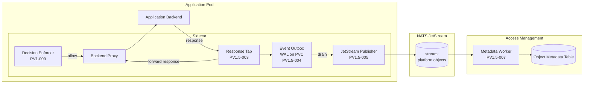
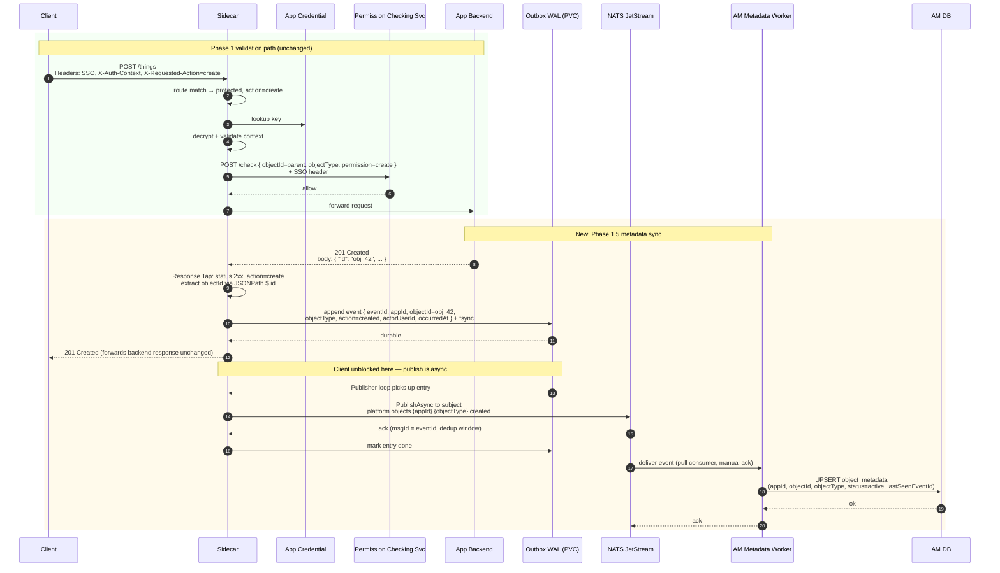

# Permission Validation Phase 1.5 — Object Metadata Sync Design

This document captures the design for an addendum to Phase 1 of the Permission Validation Flow. It introduces an asynchronous, event-driven path so that **object create and delete events flow from the sidecar to Access Management**, keeping Access Management's object metadata in sync with the truth of each application backend.

It builds on, and does not modify, the existing Phase 1 documents:

- [phase-1-user-stories.md](./phase-1-user-stories.md)
- [phase-1-architecture.md](./phase-1-architecture.md)
- [PRD.md](./PRD.md)

## 1. Scope and Phase Placement

This work is delivered as **Phase 1.5: Metadata Sync** — a slice that ships after the core Phase 1 validation flow (PV1-001 … PV1-012) is in production. It is intentionally separated because:

- Phase 1 explicitly excludes response inspection, event bus integration, and audit logging.
- The core validation path is the latency-critical, higher-risk work; it should earn operational confidence first.
- Most Phase 1.5 stories can run in parallel once contracts are locked.

### 1.1 In Scope

- Sidecar emits `object.created` and `object.deleted` events to NATS JetStream after the application backend confirms success.
- A durable Write-Ahead Log (WAL) inside the sidecar so events survive pod restarts and broker outages.
- An Access Management worker consumes events and upserts a minimal `{appId, objectId, objectType}` row, with idempotency and last-write-wins ordering.

### 1.2 Out of Scope

- Update, rename, move, owner-change, or ACL-change events.
- Cross-app event subscription or fan-out beyond Access Management.
- Backfill or reconciliation of pre-existing objects (a separate one-off job).
- Cache invalidation hooks into the permission-decision cache (Phase 1 does not cache yet).
- Replacing or normalising app-team-defined `objectId` schemes — whatever the backend returns is what is recorded.
- Detecting backend lies (a 2xx response without an actual write) — explicitly accepted as drift and addressed by a future reconciliation job.

## 2. Software Architecture

Three new modules sit inside the existing sidecar binary, plus one new service on the Access Management side. All Phase 1 components (Route Matcher, Header Extractor, Context Decryptor, Permission Request Builder, Decision Enforcer) are unchanged.



### 2.1 New Sidecar Modules

| Module | Responsibility |
|---|---|
| **Response Tap** | For routes flagged `action: create` or `action: delete`, observe the backend response. On `2xx`, extract `objectId` (from configured JSONPath for create, from decrypted context for delete) and hand a complete event record to the Outbox. On non-2xx, emit nothing. Streams the response body through to the client unchanged. |
| **Event Outbox** | Append the event record to an embedded WAL (BadgerDB or bbolt) on a PVC-backed volume. `fsync` before returning control to the Response Tap, so the client never gets `2xx` for an event that was not durably recorded. Owns the on-disk format, compaction, and crash recovery. |
| **JetStream Publisher** | Background goroutine that reads pending entries from the WAL, publishes to JetStream using the JetStream client's async publish + ack handling, and marks entries done. Retries with exponential backoff on broker errors; never blocks the request path. |

### 2.2 New Access Management Service

| Service | Responsibility |
|---|---|
| **Metadata Worker** | Durable JetStream consumer (queue group, manual ack). For each event, upserts or soft-deletes one row in the object-metadata table keyed by `(appId, objectId)`. Dedupes by `eventId`. Acks only after the DB write commits. |

## 3. Data Flow

The happy path for a protected **create**, annotated against Phase 1.



The **delete** path is identical except: the Response Tap reads `objectId` from the **decrypted context** (it already exists in Access Management), `action` is `deleted`, and the worker performs a soft-delete (`status=deleted`) rather than a hard `DELETE`.

### 3.1 Preserved Phase 1 Invariants

- Authorization decisions still happen *before* the backend is reached. The Response Tap only runs on the allow path.
- `objectId` for delete still comes only from the decrypted context — never from URL, body, or query.
- The sidecar remains the enforcement point; the metadata-sync path adds no new authorization decisions.

### 3.2 New Invariants Introduced

- The client receives `2xx` only after the event has been durably WAL-appended. There is no window where the user sees success but the platform has lost the event.
- The backend's response body and headers are forwarded to the client **unchanged**. The Response Tap observes; it never rewrites.
- Non-2xx backend responses produce no event.

## 4. Contracts

### 4.1 Event Schema

JSON, published to NATS JetStream stream `platform.objects` on subject `platform.objects.{appId}.{objectType}.{action}`:

```json
{
  "schemaVersion": 1,
  "eventId": "01HZ8K9...",
  "occurredAt": "2026-05-13T10:14:22.481Z",
  "appId": "app_billing",
  "objectId": "obj_42",
  "objectType": "invoice",
  "action": "created",
  "actorUserId": "u_7711"
}
```

| Field | Source | Notes |
|---|---|---|
| `schemaVersion` | constant `1` | Lets the worker reject unknown versions safely. |
| `eventId` | sidecar (ULID) | Used as JetStream `Nats-Msg-Id` for broker-side dedup and as the worker's idempotency key. |
| `occurredAt` | sidecar clock at backend-response time | Worker uses last-write-wins on this for ordering. |
| `appId` | decrypted authorization context | Trusted source. |
| `objectId` | response body JSONPath (create) or decrypted context (delete) | Never from URL, body, or query for delete. |
| `objectType` | decrypted authorization context | Trusted source — same value Access Management issued. |
| `action` | one of `created`, `deleted` | Derived from the route config's `action` field, **not** from the `X-Requested-Action` header (which is user intent, not proof). |
| `actorUserId` | SSO token claim | Captured for audit; Access Management may or may not store it. |

### 4.2 Route Config Extension

The Phase 1 route schema (PV1-004) gains two optional fields per protected route:

```yaml
protected:
  - method: POST
    path: /things
    action: create                       # NEW — also valid: delete
    responseObjectIdPath: "$.id"         # NEW — required only when action=create
  - method: DELETE
    path: /things/{id}
    action: delete                       # objectId comes from decrypted context
```

Rules:

- `action` is **optional**. When absent, the route behaves exactly as a Phase 1 protected route and no event is emitted.
- `responseObjectIdPath` is **required when `action: create`** and **forbidden otherwise**. Config validation rejects mismatches at sidecar startup.
- JSONPath subset: only single-value paths into the response body. No filters, no recursive descent. Keeps the parser small and predictable.
- The route's `permission` (sent to Permission Checking Service) is independent of `action`. A route can have `permission: create` and `action: create`, but the sidecar treats them as two separate fields and never derives one from the other.

### 4.3 JetStream Configuration

| Setting | Value | Reason |
|---|---|---|
| Stream | `platform.objects` | One stream, partitioned by subject. |
| Subject pattern | `platform.objects.{appId}.{objectType}.{action}` | Allows per-app or per-type filtered consumers later. |
| Retention | Limits-based, 7 days | Long enough for worker outages, short enough to bound storage. |
| Duplicate window | 2 minutes | Broker dedupes retries using `Nats-Msg-Id` = `eventId`. |
| Storage | File (replicated) | Survives broker restart. |
| Worker consumer | Durable, pull-based, queue group `am-metadata-worker`, `max-deliver=10`, `ack-wait=30s` | Horizontal scale; poison messages eventually move to DLQ subject `platform.objects.dlq`. |

## 5. Failure Handling and Edge Cases

"Drift" = Access Management's view diverges from the backend's truth.

| # | Failure | Sidecar behaviour | Drift? |
|---|---|---|---|
| 1 | Backend returns non-2xx | Forward response to client. No event emitted. | No |
| 2 | Backend returns 2xx but response body is malformed JSON | Forward response to client unchanged. Emit metric `outbox_extract_fail_total`. No event emitted. Logged at warn. | Yes, single object — accepted; covered by reconciliation backstop (§5.1) |
| 3 | Backend returns 2xx but configured JSONPath misses (no `id` field) | Same as #2. | Same as #2 |
| 4 | Backend response body exceeds the size cap (default 256 KiB) | Stop buffering at cap, forward stream to client, emit metric `outbox_response_too_large_total`. No event emitted. | Same as #2 |
| 5 | WAL append fails (disk full, fsync error) | Return `500` to the client. The backend already wrote, but the client sees a failure and the operator gets paged. No event lost. | No — client retries; idempotency on the backend determines whether a second create happens. Documented as a known risk for non-idempotent backends. |
| 6 | Sidecar crashes after WAL append, before publish | On restart, publisher loop reads the WAL and resumes. | No |
| 7 | Pod is deleted entirely (PVC unbound) | Events still on the PVC survive; if the PVC is also deleted, events are lost. SRE runbook: never delete PVCs of running app pods. | Possible only on operator error |
| 8 | JetStream broker unreachable | Publisher backs off (exponential, capped at 30s), WAL grows. Alert fires when WAL depth > threshold. Client path is unaffected. | No |
| 9 | JetStream accepts publish but worker is down | Events accumulate in the stream (7-day retention). Worker resumes from last ack offset. | No |
| 10 | Worker DB write fails | Worker `nak`s the message, JetStream redelivers up to `max-deliver=10`. After that the message moves to DLQ subject `platform.objects.dlq` and an alert fires. | Bounded — DLQ replay tool drains once the underlying issue is fixed |
| 11 | Duplicate delivery (worker crashed between DB commit and ack) | Worker upserts keyed by `(appId, objectId)`; idempotent. Also checks `lastSeenEventId` to skip stale duplicates. | No |
| 12 | Out-of-order delivery (`deleted` arrives before `created`) | Worker compares `occurredAt`; if incoming event is older than `lastSeenEventId`'s `occurredAt`, drop it. If create arrives after delete, the row stays in `deleted` state. | No (within the chosen LWW semantics) |
| 13 | Sidecar config has `action: create` but no `responseObjectIdPath` | Sidecar fails to start. Caught in CI by config validation. | N/A |
| 14 | Application backend lies — returns 2xx without actually creating the object | Sidecar emits a phantom event; Access Management records an object that doesn't exist. | Yes — out of scope; documented as a backend-contract obligation |

### 5.1 Reconciliation Backstop (out of scope for Phase 1.5, but designed-for)

Cases #2, #3, #4, and #14 admit drift. Phase 1.5 accepts this and leaves an explicit hook for a future reconciliation job that scans application backends and replays missing events. Phase 1.5 must:

- Emit `outbox_extract_fail_total` and `outbox_response_too_large_total` metrics so SRE can size the drift.
- Document the `eventId` and `(appId, objectId)` shape so a reconciliation tool can produce compatible events later.

### 5.2 What We Explicitly Do Not Do

- **No fail-open emission.** If we cannot extract the objectId, we never guess from URL, body, or query — that would violate the same trust boundary Phase 1 protects.
- **No client-visible retry of the publish.** The client's success or failure response depends only on the WAL append, never on JetStream.
- **No cross-event transactions.** Each event is independent; the worker never tries to wait for related events.

## 6. Observability and Testing

### 6.1 Sidecar Metrics

Added to the Phase 1 PV1-010 set:

| Metric | Type | Labels | Purpose |
|---|---|---|---|
| `outbox_events_emitted_total` | counter | `appId`, `action`, `objectType` | Throughput of successfully WAL-appended events. |
| `outbox_extract_fail_total` | counter | `appId`, `reason` (`bad_json`, `path_miss`, `too_large`) | Drift signal — every increment is one object Access Management will not learn about. |
| `outbox_wal_depth` | gauge | — | Pending unpublished entries. Alert threshold: depth > 1000 or growing for 5 min. |
| `outbox_wal_append_latency_seconds` | histogram | — | Latency cost added to create/delete responses. SLO: P95 < 2 ms. |
| `outbox_publish_latency_seconds` | histogram | — | Time from WAL append to JetStream ack. Visibility into broker health. |
| `outbox_publish_fail_total` | counter | `reason` (`broker_unreachable`, `nack`, `timeout`) | Publisher health. |
| `outbox_response_too_large_total` | counter | `appId`, `objectType` | Sized responses being dropped — informs the 256 KiB cap. |

### 6.2 Worker Metrics

| Metric | Type | Labels | Purpose |
|---|---|---|---|
| `am_metadata_events_consumed_total` | counter | `action`, `objectType` | Throughput. |
| `am_metadata_db_write_latency_seconds` | histogram | `action` | Worker health. |
| `am_metadata_duplicate_skipped_total` | counter | — | Dedup hits — informs JetStream dedup-window sizing. |
| `am_metadata_dlq_total` | counter | `reason` | Poison messages; alert > 0 over 5 min. |
| `am_metadata_consumer_lag` | gauge | — | JetStream pending count for the durable consumer. |

### 6.3 Logging

- **Sidecar**, info: one line per WAL append and one per successful publish, both keyed by `eventId`.
- **Sidecar**, warn: extract failures and publish retries, rate-limited per `appId` to avoid log spam.
- **Worker**, info: one line per ack with `eventId`, `(appId, objectId)`, `action`, latency.
- **Worker**, error: DLQ moves, with full event payload sans `actorUserId` (PII redaction).
- Raw response bodies, SSO tokens, and encrypted contexts never appear in logs.

### 6.4 Tests

**Unit tests**

| Target | Cases |
|---|---|
| Response Tap | JSONPath hit / miss / malformed body / body over cap / non-2xx response / streaming pass-through preserves bytes byte-for-byte. |
| Outbox | WAL append + fsync ordering; crash recovery (kill -9 then restart, expect entries replayed); compaction after ack. |
| Publisher | Backoff schedule; ack handling; idempotent publish under retry (same `Nats-Msg-Id` twice → broker dedupes). |
| Worker | Upsert semantics; LWW on `occurredAt`; duplicate `eventId` ignored; out-of-order delete-before-create produces deleted state. |

**Integration tests** (extend PV1-011)

- Granted create → backend returns 201 with id → event appears in test JetStream → worker upserts row in test DB.
- Granted delete → event appears → worker marks row deleted.
- Backend returns 500 → no event emitted.
- Backend returns 2xx with malformed body → no event emitted, `outbox_extract_fail_total` increments.
- JetStream down at start → events accumulate in WAL → broker comes up → events drain in order.
- Sidecar killed between WAL append and publish → restart → events drain.
- Worker receives two copies of the same `eventId` → DB has one row.
- Phase 1 protected routes **without** `action` config → metadata-sync code path is never invoked (regression guard).

**Load test**

- Sustained 5,000 RPS on protected routes (Phase 1 SLO), of which 10% are create/delete. Verify:
  - P95 sidecar latency budget still under 10 ms (Phase 1 SLO).
  - WAL append P95 under 2 ms.
  - WAL depth stays under 100 in steady state.

## 7. Story Breakdown

Estimate buckets per the Phase 1 convention (S: 1-2 d, M: 3-5 d, L: 1-2 w, XL: split).

| ID | Title | Est. | Depends on |
|---|---|---|---|
| **PV1.5-001** | Define `object.created` / `object.deleted` event schema, JetStream stream/subject/dedup config, and `eventId` generation rules | S | — |
| **PV1.5-002** | Extend route-config schema with `action` and `responseObjectIdPath`; add startup validation | S | PV1-004 |
| **PV1.5-003** | Implement Response Tap: buffer response (size-capped), pass through unchanged, extract `objectId` via JSONPath on 2xx create / from decrypted context on 2xx delete | M | PV1.5-002, PV1-007, PV1-009 |
| **PV1.5-004** | Implement Event Outbox WAL (embedded store, fsync-before-ack, crash recovery, compaction) | L | PV1.5-001 |
| **PV1.5-005** | Implement JetStream Publisher loop with retry/backoff, ack handling, dedup via `Nats-Msg-Id` | M | PV1.5-004 |
| **PV1.5-006** | Wire Response Tap → Outbox → Publisher inside the sidecar; surface `500` to client on WAL append failure | S | PV1.5-003, PV1.5-005 |
| **PV1.5-007** | Build Access Management Metadata Worker (durable JetStream consumer, idempotent upsert, LWW ordering, DLQ on poison) | L | PV1.5-001 |
| **PV1.5-008** | Add Access Management object-metadata table + migration (`appId`, `objectId`, `objectType`, `status`, `lastSeenEventId`, `occurredAt`, timestamps) | S | — |
| **PV1.5-009** | Add Phase 1.5 metrics (sidecar + worker) and SRE alert thresholds | M | PV1.5-006, PV1.5-007 |
| **PV1.5-010** | Add Phase 1.5 integration tests covering happy path, malformed responses, broker outage, sidecar restart, worker dedup, out-of-order delivery | M | PV1.5-006, PV1.5-007 |
| **PV1.5-011** | Load test: 5,000 RPS sustained with 10% create/delete mix; verify Phase 1 SLO still met and WAL depth bounded | M | PV1.5-010 |
| **PV1.5-012** | Extend Phase 1 onboarding example (PV1-012) with a create + delete route and the new config fields | S | PV1.5-002, PV1.5-006 |

Roughly 5-7 weeks of work depending on parallelism — the two L-sized stories (Outbox and Worker) can run concurrently after PV1.5-001 locks the schema.

## 8. Open Items for Implementation

Pinned now so they are not forgotten when writing the implementation plan:

- Embedded WAL choice between BadgerDB, bbolt, and SQLite-in-WAL-mode. Evaluation should compare fsync cost, recovery time after kill, and operational footprint.
- Response-body size cap (default 256 KiB) — confirm against the largest expected create response across known apps.
- DLQ replay tool: not a Phase 1.5 deliverable, but the DLQ subject (`platform.objects.dlq`) must be created and documented so a future tool has a target.
- PVC sizing and reclaim policy for the WAL volume; SRE runbook entry for "never delete the PVC of a running app pod."
