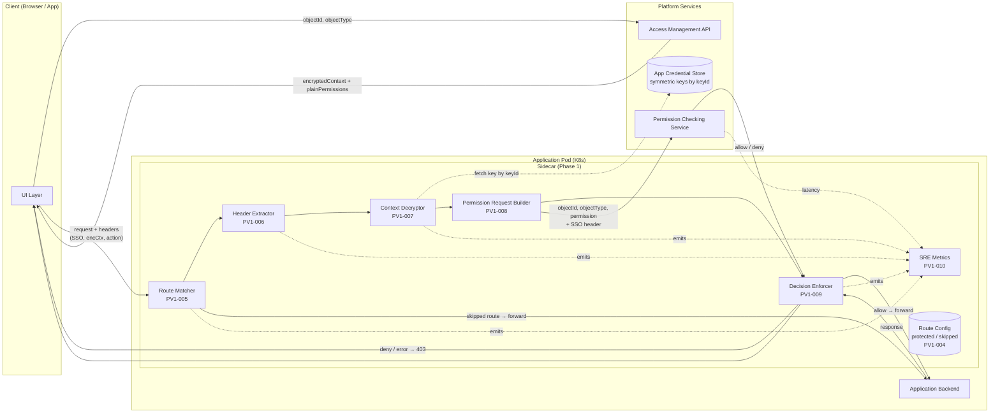
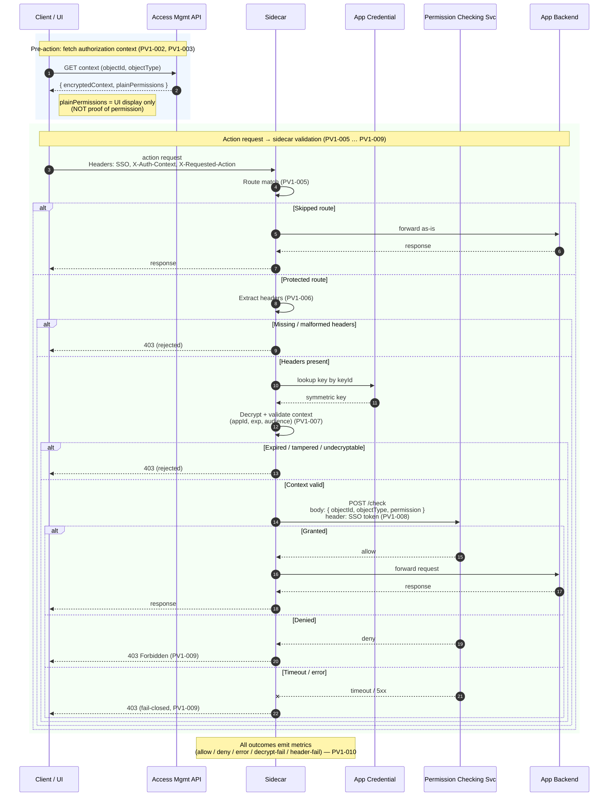

# Permission Validation Phase 1 — Sidecar Architecture

This document captures the Phase 1 sidecar **software architecture** and **data flow**, derived from [phase-1-user-stories.md](./phase-1-user-stories.md). Each component and step is annotated with the user story it satisfies.

## 1. Software Architecture

### Component responsibilities

| Component | User story | Responsibility |
|---|---|---|
| Route Matcher | PV1-005 | Decide whether incoming request is protected, skipped, or unmatched, based on route config (PV1-004). |
| Header Extractor | PV1-006 | Pull SSO token, encrypted context, and requested action from headers; reject if missing/malformed. |
| Context Decryptor | PV1-007 | Decrypt + verify the authorization context (authenticated encryption, expiry, audience) using app credential. |
| Permission Request Builder | PV1-008 | Compose the PCS payload from the **decrypted** `objectId`/`objectType` and the requested `permission`; forward SSO in headers. |
| Decision Enforcer | PV1-009 | Forward on allow; return `403` on deny, timeout, or error (fail-closed). |
| SRE Metrics | PV1-010 | Emit counters and latencies for traffic, outcomes, decryption failures, and header errors. |
| Route Config | PV1-004 | Declarative list of protected and skipped routes (method + path). |
| App Credential Store | PV1-003 | Source of symmetric keys, keyed by `keyId`, provisioned at app registration. |

## 2. Data Flow — Protected Request

## 3. Key Invariants

- `objectId` / `objectType` come **only** from the decrypted authorization context — never from the URL, body, or query string. Path/body extraction is explicitly out of Phase 1 scope.
- `permission` comes from the `X-Requested-Action` header — treated as **user intent**, not proof of permission (PV1-002).
- The plain permissions returned by Access Management API are **UI display data only** and never trusted by the sidecar (PV1-003).
- Default failure mode is **fail-closed**: any header, decryption, or PCS error returns `403`. Fail-open behavior is out of Phase 1 scope.
- Skipped routes bypass decryption and the Permission Checking Service entirely (PV1-004, PV1-005).
- The sidecar — not the application backend — is the enforcement point. Rejected requests must never reach the backend (PV1-009, PV1-011).

## 4. Out-of-Scope Reminders

The architecture above intentionally omits the following Phase 1 non-goals (see `phase-1-user-stories.md` → "Out Of Scope For Phase 1"):

- Decision caching and event-driven invalidation.
- Body, query, and general path-parameter extraction.
- Fail-open behavior, distributed tracing, and detailed audit logging.
- Per-route cache behavior, advanced action mapping, automatic key rotation.
- Cross-checking that the application path's object ID matches the decrypted `objectId`.
