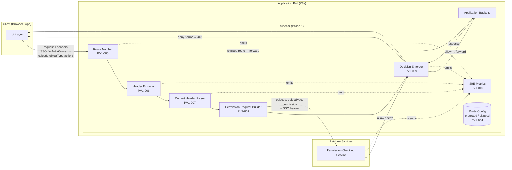
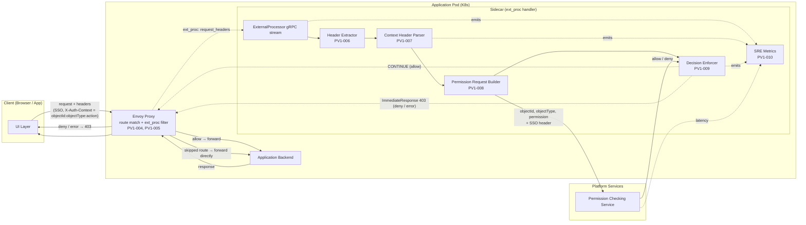
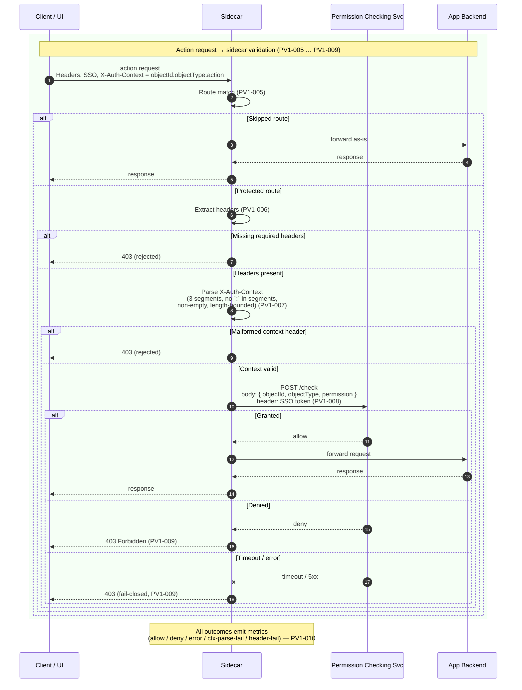

# Permission Validation Phase 1 — Sidecar Architecture

This document captures the Phase 1 sidecar **software architecture** and **data flow**, derived from [phase-1-user-stories.md](./phase-1-user-stories.md). Each component and step is annotated with the user story it satisfies.

## 1. Software Architecture

This section documents Phase 1 under both candidate topologies; PV1-001 is decided in favor of **Option B (Envoy `ext_proc` + sidecar)** — see [phase-1-topology-decision.md](./phase-1-topology-decision.md). The data flow (§2) and invariants (§3) apply to both topologies; the Option A diagram is preserved below for reference because the validator-level component responsibilities are identical.

### Component responsibilities

| Component | User story | Responsibility |
|---|---|---|
| Route Matcher | PV1-005 | Decide whether incoming request is protected, skipped, or unmatched, based on route config (PV1-004). |
| Header Extractor | PV1-006 | Pull SSO token and the combined `X-Auth-Context` header; reject if missing. |
| Context Header Parser | PV1-007 | Split `X-Auth-Context` into `objectId`, `objectType`, `action`; reject if format rules (PV1-003) are violated. |
| Permission Request Builder | PV1-008 | Compose the PCS payload from the parsed `objectId`/`objectType`/`permission`; forward SSO in headers. |
| Decision Enforcer | PV1-009 | Forward on allow; return `403` on deny, timeout, or error (fail-closed). |
| SRE Metrics | PV1-010 | Emit counters and latencies for traffic, outcomes, header presence errors, and context-parse failures. |
| Route Config | PV1-004 | Declarative list of protected and skipped routes (method + path). |

### Alternative Topology — Envoy `ext_proc` Filter

The same Phase 1 flow can be implemented with Envoy in the request path and the sidecar acting as an `envoy.extensions.filters.http.ext_proc.v3.ExternalProcessor` gRPC handler. The functional components (PV1-006 … PV1-010) are unchanged; route matching (PV1-005) and request forwarding move out of the sidecar and into Envoy. There is no Access Management API call in the request path and no app credential lookup — the sidecar is a thin parser + PCS caller.

#### Component placement under `ext_proc`

| Option A (custom proxy sidecar) | Option B (Envoy `ext_proc`) |
|---|---|
| Route Matcher (sidecar code, PV1-005) | Envoy route configuration |
| Route Config (sidecar config, PV1-004) | Envoy `RouteConfiguration` + per-route `ExtProcPerRoute` overrides |
| HTTP request forwarding to backend | Envoy upstream cluster |
| Fail-closed on sidecar error (PV1-009) | Envoy `failure_mode_allow: false` |
| Header Extractor / Parser / Builder / Enforcer | Sidecar `ExternalProcessor` gRPC handler, unchanged |
| SRE Metrics (PV1-010) | Split — outcome and parse-failure metrics in sidecar; filter latency, deny rate, and upstream RTT from Envoy |

#### Notable trade-offs

- **Smaller sidecar surface.** No HTTP proxy code, no upstream connection pool, no route matcher. Sidecar is a pure validator.
- **Envoy becomes a platform dependency.** Every protected pod runs Envoy; operational ownership, version pinning, and config delivery (xDS or static) must be settled before adoption.
- **Skipped routes bypass the sidecar process entirely.** PV1-004 skipped paths are expressed as `ExtProcPerRoute.disabled: true` and never enter the sidecar.
- **Forward-compatibility with Phase 1.5.** The Response Tap and "client receives `2xx` only after WAL is durable" behavior described in [phase-1-5-metadata-sync-design.md](./phase-1-5-metadata-sync-design.md) require response-phase participation. `ext_proc` supports this by enabling `response_header_mode: SEND` and `response_body_mode: BUFFERED` on create/delete routes via `ExtProcPerRoute`. The closely related `ext_authz` filter is request-only and cannot satisfy the Phase 1.5 §3.2 invariant on its own; this is why Option B uses `ext_proc` rather than `ext_authz`.
- **gRPC streaming complexity.** The sidecar maintains one bidirectional stream per HTTP transaction. Ordering of `request_headers`, `response_headers`, `response_body`, and `ImmediateResponse` messages is on the sidecar.

PV1-001 selected Option B as the Phase 1 topology — see [phase-1-topology-decision.md](./phase-1-topology-decision.md).

## 2. Data Flow — Protected Request

The logical decisions, ordering, and fail-closed semantics below are identical under both topologies. Under Option B, the `Sidecar` lane represents the sidecar's `ext_proc` handler and Envoy sits transparently between the client and the sidecar in the request path; the sidecar's `forward` action becomes a `CONTINUE` response that releases Envoy to call the backend.

## 3. Key Invariants

- `objectId`, `objectType`, and `permission` come **only** from the parsed `X-Auth-Context` header — never from the URL, body, or query string. Path/body extraction is explicitly out of Phase 1 scope.
- The `action` segment of `X-Auth-Context` is treated as **user intent**, not proof of permission (PV1-002, PV1-003). PCS is the sole authority on whether the user holds it.
- Phase 1 trusts the client to declare a truthful `(objectId, objectType)`. URL / body cross-checking is explicitly out of Phase 1 scope and is the residual risk documented in [phase-1-user-stories.md → Phase 1 Scope](./phase-1-user-stories.md#phase-1-scope).
- Default failure mode is **fail-closed**: any header, parse, or PCS error returns `403`. Fail-open behavior is out of Phase 1 scope.
- Skipped routes bypass context parsing and the Permission Checking Service entirely (PV1-004, PV1-005).
- The sidecar — not the application backend — is the enforcement point. Rejected requests must never reach the backend (PV1-009, PV1-011).

## 4. Out-of-Scope Reminders

The architecture above intentionally omits the following Phase 1 non-goals (see `phase-1-user-stories.md` → "Out Of Scope For Phase 1"):

- Encrypted or signed authorization context, app credential provisioning, and Access Management API in the request path.
- Decision caching and event-driven invalidation.
- Body, query, and general path-parameter extraction.
- Fail-open behavior, distributed tracing, and detailed audit logging.
- Per-route cache behavior, advanced action mapping.
- Cross-checking that the application path / body object ID matches the context-header `objectId`.
