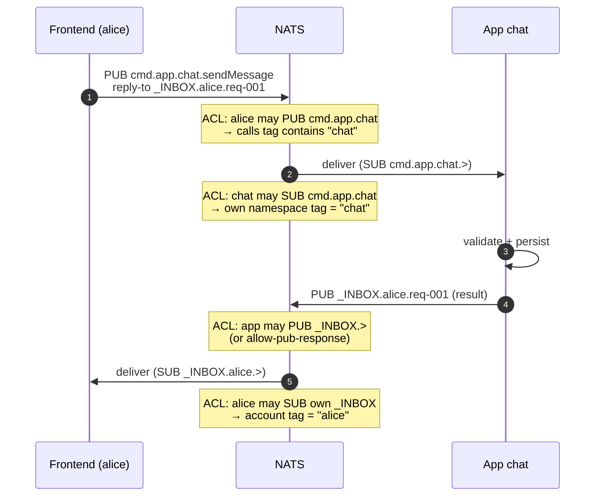
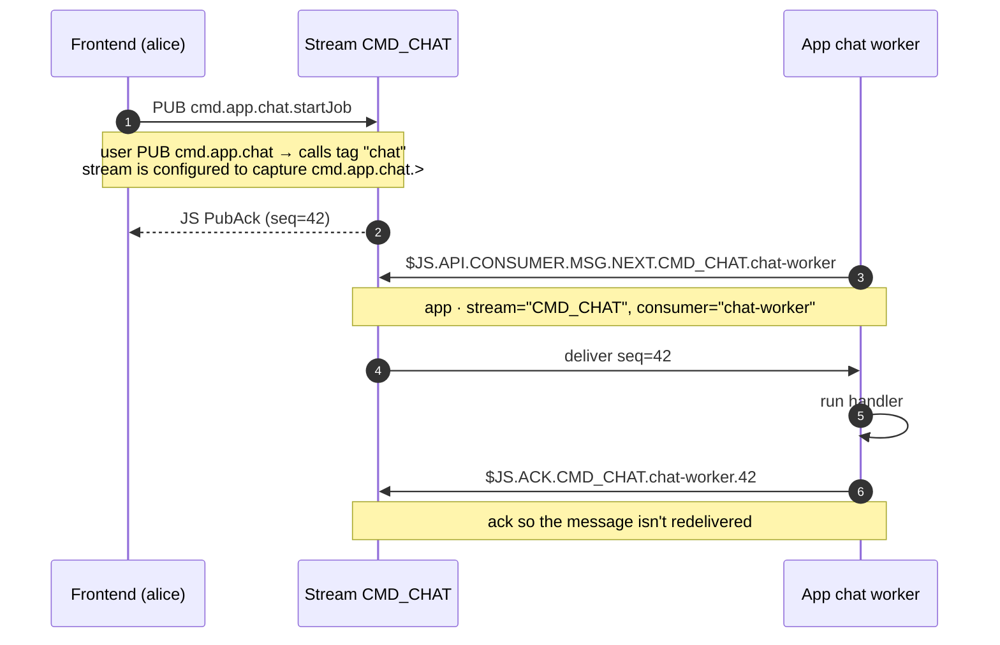
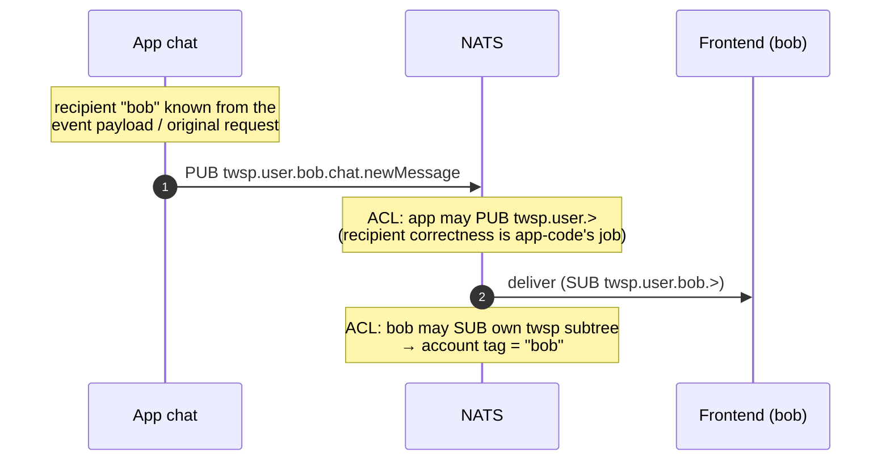
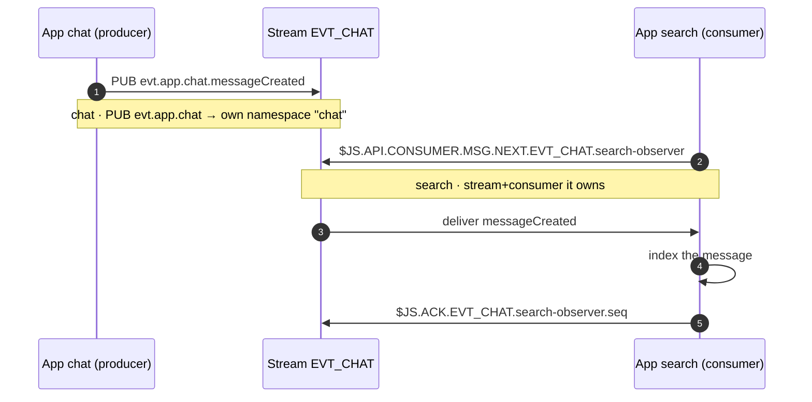
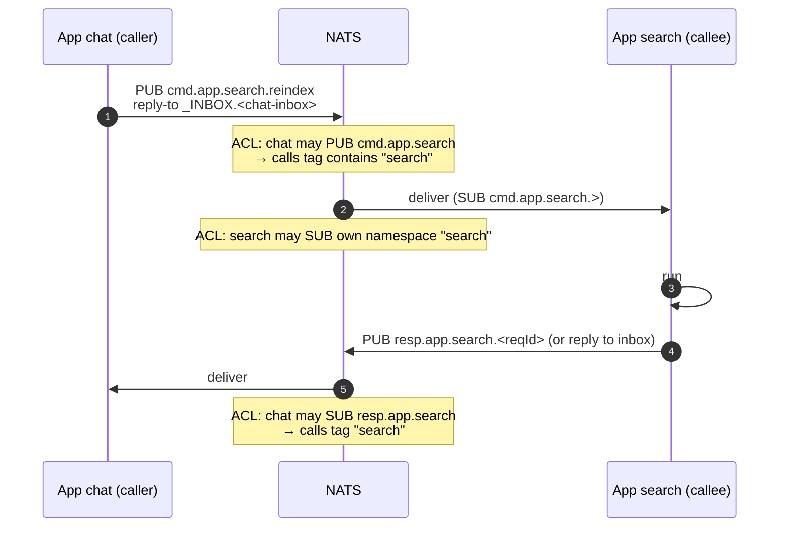
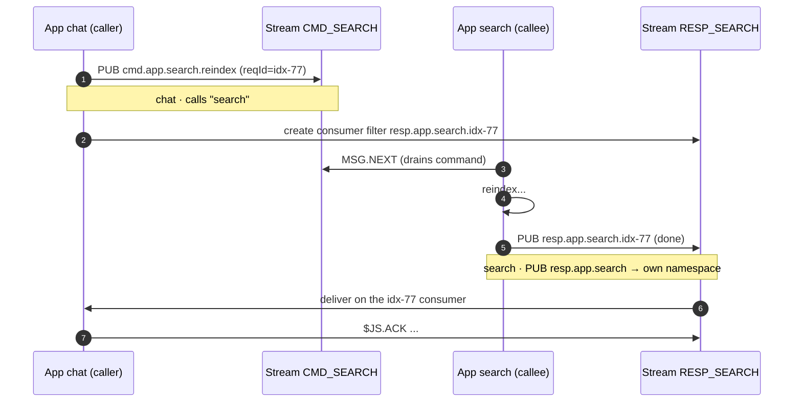
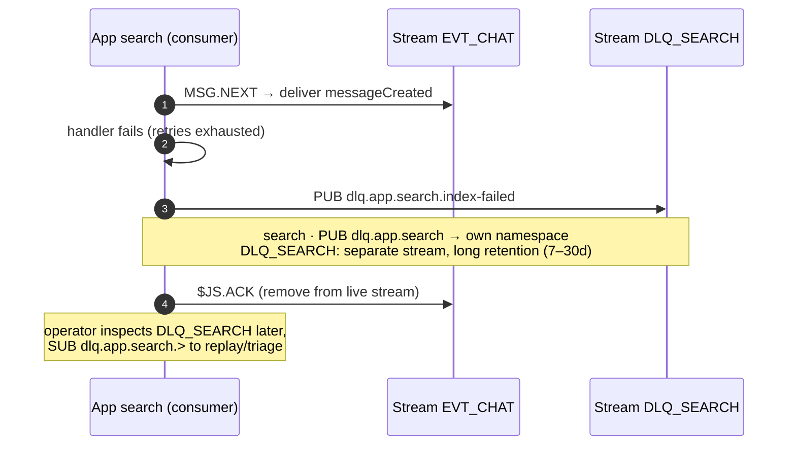
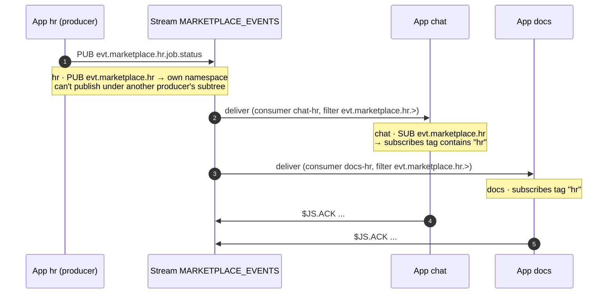

# Workspace Platform — NATS Message Flows & Scenarios

Companion to `workspacenatspermissions.md`. That doc defines the **two scoped
signing keys and six tags**; this doc walks **every message flow** those
permissions exist to serve — frontend→app, app→app, app→frontend — as a sequence
diagram plus the subjects each hop uses, which key/tag authorizes it, and *why*
the permission is needed for that scenario.

If a permission in the spec ever looks unnecessary, find the scenario here that
requires it. Nothing in the templates exists without a flow behind it.

---

## Actors & legend

| Actor | Identity | Key | Key tags |
|-------|----------|-----|----------|
| **Frontend** | logged-in user (`account:alice`) | user-flow | `account`, `calls` |
| **App A / App B** | a backend service (`namespace:chat`) | app-flow | `namespace`, `calls`, `subscribes`, `stream`, `consumer` |
| **NATS** | the broker; enforces ACL from the presented JWT | — | — |
| **Stream** | a JetStream stream (durable log) | — | — |

**The three messaging patterns** (every scenario below is exactly one of these):

| Pattern | Shape | Delivery | Use when |
|---------|-------|----------|----------|
| **Core request-reply** | PUB with a `reply-to` inbox; one responder replies | transient, at-most-once; caller retries on timeout | you need an answer *now* and can retry |
| **Core pub/sub** | PUB to a subject; 0..N live subscribers; **no reply** | transient, fire-and-forget; only online subscribers get it | live/ephemeral signals where loss is acceptable |
| **JetStream** | PUB into a stream; durable pull consumer drains + acks | persisted, at-least-once; survives crash/reconnect/offline | the message must not be lost |

**One-line chooser:** answer-now + retryable → **core request-reply**; live signal,
loss OK → **core pub/sub**; must-not-lose / offline / replay → **JetStream**.

**Tag reminder:** `namespace` = the app's **own** identity (single). `calls` =
apps you may invoke. `subscribes` = marketplace producers you consume. All
user-facing return paths are keyed by `account`.

---

## Scenario index

| # | Direction | Scenario | Messaging pattern |
|---|-----------|----------|-------------------|
| 1 | frontend → app | Synchronous request-reply | **core request-reply** |
| 2 | frontend → app | Durable command (survives crash) | **JetStream** |
| 3 | app → frontend | Live targeted push | **core pub/sub** |
| 4 | app → frontend | Durable push / offline catch-up | **JetStream** |
| 5 | app → app | Event-driven (loose coupling) | **JetStream** (or core pub/sub if loss OK) |
| 6 | app → app | Synchronous RPC | **core request-reply** |
| 7 | app → app | Asynchronous durable RPC | **JetStream** (resp-backed) |
| 8 | app → app | Failure path → DLQ | **JetStream** |
| 9 | app → many apps | Marketplace fan-out | **JetStream** |
| 10 | end-to-end | One user action → reply + push + peer index | **mixed** (all three) |
| 11 | control-plane | Entitlement change → reconnect | — (HTTP + reconnect) |

---

## 1. Frontend → App — synchronous request-reply (core NATS)

**Pattern: core request-reply** — PUB `cmd` with a `reply-to` inbox; the app replies once.

**When:** user clicks something and the UI waits for an immediate answer
("send message", "rename doc"). The caller will retry on timeout; no durability
needed.



**Subjects & why:**

| Hop | Subject | Op | Key · tag | Why needed |
|-----|---------|----|-----------|------------|
| 1 | `cmd.app.chat.>` | PUB | user · `calls` | user must be able to invoke the apps they're entitled to |
| 2 | `cmd.app.chat.>` | SUB | app · `namespace` | app must receive commands addressed to its own namespace |
| 4 | `_INBOX.alice.req-001` | PUB | app · `_INBOX.>` | app must be able to send the reply back to the caller's inbox |
| 5 | `_INBOX.alice.>` | SUB | user · `account` | user must read replies to their **own** requests only |

---

## 2. Frontend → App — durable command (JetStream)

**Pattern: JetStream** — PUB `cmd` into a stream; a worker pulls and acks. No live reply required.

**When:** the command must not be lost if the backend is momentarily down
("submit job", "start workflow"). The command lands in a stream and a worker
drains it at its own pace.



**Subjects & why:**

| Subject | Op | Key · tag | Why needed |
|---------|----|-----------|------------|
| `cmd.app.chat.>` | PUB | user · `calls` | same invoke right as §1; the stream captures the subject |
| `$JS.API.CONSUMER.MSG.NEXT.CMD_CHAT.chat-worker` | PUB | app · `stream`+`consumer` | pull the next durable command from the app's own consumer |
| `$JS.ACK.CMD_CHAT.chat-worker.>` | PUB | app · `stream`+`consumer` | acknowledge so at-least-once delivery completes |

> The frontend needs **no** JetStream permission — it just publishes the command
> subject. Only the app drains the stream. (This is why the user-flow key has no
> `$JS.*` rules.)

---

## 3. App → Frontend — live targeted push (core NATS)

**Pattern: core pub/sub** — PUB to `twsp.user.<acct>`; no reply. Only online users receive it.

**When:** an app has an update for a *specific* online user (progress, a new
message, a notification). Delivered only if the user is connected; lost otherwise
(use §4 if it must survive offline).



**Subjects & why:**

| Subject | Op | Key · tag | Why needed |
|---------|----|-----------|------------|
| `twsp.user.>` | PUB | app · (broad) | one app connection serves all users; it can't hold a per-user JWT, so it may publish to any user's push subtree. Correct recipient is chosen by app code from the event. |
| `twsp.user.bob.>` | SUB | user · `account` | user receives pushes for **their own** account only — this SUB scope is what contains the app's broad PUB. A wrong-recipient push reaches no one improper. |

> This asymmetry (app PUB broad, user SUB narrow) is deliberate: the ACL guarantees
> a push can only ever be *read* by its intended user, even if app code targets the
> wrong subject.

---

## 4. App → Frontend — durable push / offline catch-up (JetStream)

**Pattern: JetStream** — pushes land in a stream; a per-user filtered consumer replays them.

**When:** the user must eventually see it even if offline now (unread messages,
notifications). Pushes land in a stream; a per-user filtered consumer replays them
on reconnect.

```mermaid
sequenceDiagram
    autonumber
    participant A as App chat
    participant S as Stream TWSP_USER
    participant FE as Frontend (bob)

    A->>S: PUB twsp.user.bob.chat.newMessage
    Note over A,S: app · PUB twsp.user.> ; stream captures twsp.user.>
    Note over FE: bob reconnects later
    FE->>S: $JS.API.CONSUMER.MSG.NEXT.TWSP_USER.bob-own
    Note over FE,S: consumer filter = twsp.user.bob.><br/>enforced at consumer-create by auth-service
    S->>FE: deliver backlog
    FE->>S: $JS.ACK.TWSP_USER.bob-own.seq
```

**Two models for who drains the stream:**

- **Backend drains, re-pushes live (recommended):** the app owns the consumer
  (`stream:TWSP_USER, consumer:...` on the **app** key) and forwards to the user via
  §3. Frontend stays JetStream-free. Matches the "no consumers on frontend" rule.
- **Frontend pulls directly (only if justified):** the user key would then need
  `stream:TWSP_USER` + `consumer:bob-own` tags and the two `$JS.*` pull/ack rules —
  and the consumer's filter subject **must** be pinned to `twsp.user.bob.>` at
  create time so a user can't drain another user's backlog. Prefer the backend-drain
  model to avoid granting frontends any JetStream surface.

---

## 5. App → App — event-driven, loose coupling (JetStream)

**Pattern: JetStream** (durable) — producer PUBs to its event bus; consumers pull + ack. Use **core pub/sub** instead only when subscribers can re-derive on reconnect and loss is acceptable.

**When:** App A does something other apps may care about, but A shouldn't know who
they are ("message created" → search indexes it, analytics counts it). A publishes
to its **own** event bus; consumers opt in.



**Subjects & why:**

| Subject | Op | Key · tag | Why needed |
|---------|----|-----------|------------|
| `evt.app.chat.>` | PUB | producer · `namespace` | an app publishes events on its **own** bus only — can't forge another app's events |
| `evt.app.chat.>` | SUB | producer · `namespace` | own replicas/self-consumption |
| `$JS.API.CONSUMER.*` / `$JS.ACK.*` | PUB | consumer · `stream`+`consumer` | the consumer app owns a consumer on the event stream and acks |

> **Note on cross-app event subscription:** `evt.app.<ns>` is scoped to the
> producer's **own** namespace on both PUB and SUB in the final template — i.e. an
> app subscribes to its *own* bus. Cross-app event consumption is intended to flow
> through the **marketplace** (`evt.marketplace` + `subscribes`, §9), which gives a
> single governed catalog surface rather than ad-hoc reach into every app's private
> `evt.app` bus. Use §9 for "App B wants App A's events."

---

## 6. App → App — synchronous RPC (core NATS)

**Pattern: core request-reply** — caller PUBs `cmd` with a `reply-to` inbox; callee replies once.

**When:** App A needs an answer from App B now ("reindex and tell me when done"),
will retry on timeout, no durability needed. Requires an approved caller
relationship (`app_call_grants` row → `calls:search` on chat's JWT).



**Subjects & why:**

| Subject | Op | Key · tag | Why needed |
|---------|----|-----------|------------|
| `cmd.app.search.>` | PUB | caller · `calls` | invoke a **peer** app — only if the relationship is registered |
| `cmd.app.search.>` | SUB | callee · `namespace` | callee receives commands to its own namespace |
| `resp.app.search.>` | PUB | callee · `namespace` | callee answers on its own resp subtree |
| `resp.app.search.>` | SUB | caller · `calls` | caller reads responses from the app it called. **App→app completions use `resp.app` (namespace-keyed) — never a user return path.** |

> **Source & forgeability (app→app):** the callee receives `cmd.app.search` but the
> subject names the *target*, not the *sender* — any app with `calls:search` could
> publish it. So a callee must **not** trust a `source` in the payload or the
> `ce-source` header to decide *who* called. Producer identity (for
> `evt`/`resp`/`marketplace`) *is* trustworthy because those subjects are locked to
> the producer's own `namespace` — derive identity from the **subject**, never the
> payload. Full analysis: `workspacenatspermissions.md` §6.10.

---

## 7. App → App — asynchronous durable RPC (JetStream, resp-backed)

**Pattern: JetStream** — command and response both flow through streams; caller drains the response by `reqId`. (Durable variant of the request-reply in §6.)

**When:** long-running peer call that must survive a restart on either side. The
command goes through a stream; the response is published to a `resp` subject
captured by a short-retention `RESP_*` stream that the caller drains by `reqId`.



**Subjects & why:** same `cmd`/`resp` grants as §6, plus the caller's and callee's
`$JS.*` rules (`stream`+`consumer`) to drive the durable command and response
streams. `RESP_*` streams use short retention (interest / small `max_age`) so
completed correlation ids don't accumulate.

---

## 8. App → App — failure path → DLQ (JetStream)

**Pattern: JetStream** — poisoned message re-published into a separate long-retention DLQ stream; no reply.

**When:** a consumer can't process a message after its retries are exhausted. It
publishes the poisoned message to its **own** dead-letter subject on a separate,
long-retention stream for later inspection — instead of nak-looping forever.



**Subjects & why:**

| Subject | Op | Key · tag | Why needed |
|---------|----|-----------|------------|
| `dlq.app.search.>` | PUB | app · `namespace` | park failed messages on the app's own DLQ |
| `dlq.app.search.>` | SUB | app · `namespace` | drain/triage/replay its own DLQ |

> DLQ lives on a **separate stream** with long retention — never inside the live
> event stream, whose short TTL would delete the dead letter before anyone looks
> (see `workspacenatspermissions.md` §6.4).

---

## 9. App → many apps — marketplace fan-out (JetStream)

**Pattern: JetStream** — one producer subtree, N independent durable consumers each with their own cursor; no reply.

**When:** an app publishes catalog/public events that any number of other apps may
subscribe to through a governed catalog ("HR publishes job.status; chat, docs,
drive consume it"). One producer subtree, N independent consumers.



**Subjects & why:**

| Subject | Op | Key · tag | Why needed |
|---------|----|-----------|------------|
| `evt.marketplace.hr.>` | PUB | producer · `namespace` | a producer publishes catalog events under its **own** namespace only |
| `evt.marketplace.hr.>` | SUB | consumer · `subscribes` | a consumer reads only the producers it's registered to (a `marketplace_subscriptions` row) |
| `$JS.API.CONSUMER.*` / `$JS.ACK.*` | PUB | consumer · `stream`+`consumer` | each consumer drives its own consumer on the marketplace stream |

> Subscribing chat to hr's catalog is a single **row** in `marketplace_subscriptions`
> → `subscribes:hr` on chat's next JWT. No template change.

---

## 10. End-to-end cascade — one user action

**Pattern: mixed (all three)** — inbound `cmd` (core request-reply §1) fans out to a JetStream event (§5), a core pub/sub push (§3), and a core request-reply ack.

**When:** the realistic combined flow. Alice sends a message → chat persists it →
bob is notified → search indexes it → alice gets her ack. One inbound `cmd` fans
out to three outbound subjects, each with its own grant.

```mermaid
sequenceDiagram
    autonumber
    participant FE as Frontend (alice)
    participant A as App chat
    participant BE as Frontend (bob)
    participant SE as App search

    FE->>A: PUB cmd.app.chat.sendMessage (reply-to _INBOX.alice.req-001)
    Note over FE,A: alice calls "chat" · chat SUB own namespace
    A->>A: validate + persist
    par notify recipient
        A->>BE: PUB twsp.user.bob.chat.newMessage
        Note over A,BE: app PUB twsp.user.> · bob SUB own account
    and fan out event
        A->>SE: PUB evt.app.chat.messageCreated (JS-backed)
        Note over A,SE: search consumes via marketplace/observer
        SE->>SE: index (ack; on failure → dlq.app.search)
    and ack caller
        A->>FE: PUB _INBOX.alice.req-001 (status ok)
        Note over A,FE: alice SUB own _INBOX
    end
```

**The three outbound directions from one command:**

| Outbound | Subject | Audience | Authorized by |
|----------|---------|----------|---------------|
| notify a user | `twsp.user.bob.>` | bob | app PUB `twsp.user.>` / bob `account` |
| broadcast an event | `evt.app.chat.>` → search | any interested app | chat `namespace` / consumer `subscribes` |
| ack the caller | `_INBOX.alice.req-001` | alice | app `_INBOX.>` / alice `account` |

Every non-transient hop can be JetStream-backed so nothing is lost across
reconnects; the transient ack can stay core NATS.

---

## 11. Control-plane — entitlement change → reconnect

**Pattern: none (out-of-band)** — an HTTP re-mint to `/api/v1/auth` + a NATS reconnect. Not a message flow; it's how the permissions behind every flow above are refreshed.

**When:** a grant/revoke must take effect. Permissions live in the JWT, the JWT is
a frozen snapshot of the registries, so a change only applies after a fresh mint +
reconnect.

```mermaid
sequenceDiagram
    autonumber
    participant U as User / Admin action
    participant R as Registry service
    participant AU as auth-service
    participant CL as Client (frontend or sidecar)
    participant N as NATS

    U->>R: install app / approve peer / subscribe
    R->>R: INSERT row (entitlement / call-grant / subscription)
    opt instant
        R-->>CL: "refresh now" (frontend re-mints; or webhook→sidecar.Refresh())
    end
    CL->>AU: POST /api/v1/auth (re-mint)
    AU->>R: read current rows → compute tags
    AU-->>CL: fresh JWT (new calls / subscribes)
    CL->>N: reconnect with new JWT
    Note over N: new pub/sub rule now live
```

- **Frontend (user flow):** after writing the entitlement row, the frontend
  re-calls `/api/v1/auth` and reconnects → new `calls` value usable immediately.
- **App-to-app / marketplace (app flow):** the sidecar's refresh loop re-mints on
  schedule and reconnects; picked up at the next refresh with no redeploy. Force a
  re-mint for instant effect.
- **Revoke:** delete the row; existing JWT still allows it until expiry (exposure
  window = token lifetime), then the tag drops and NATS denies. Force a re-mint for
  instant revoke.

Latency is governed by the **token lifetime** (plus optional force-remint);
correctness never depends on it.

---

## Pattern → permissions it requires

The messaging pattern *is* what decides which classes of permission a flow needs:

| Pattern | Subject permissions | Inbox permissions | JetStream permissions |
|---------|--------------------|--------------------|-----------------------|
| **Core request-reply** | PUB the target `cmd`/`resp` subject; SUB the target on the responder | **yes** — caller SUB own `_INBOX`; responder PUB `_INBOX.>` (or allow-pub-response) | **none** |
| **Core pub/sub** | PUB the subject on producer; SUB the subject on consumer | none | **none** |
| **JetStream** | PUB the subject the stream captures | none (delivery is via the consumer, not an inbox) | **yes** — `$JS.API.CONSUMER.*` to pull + `$JS.ACK.*` to ack, scoped by `stream`/`consumer` |

Consequences that fall out of this:

- **The user-flow key has no `$JS.*` rules** because a frontend only ever *publishes*
  a command subject (§2) or *subscribes* to its own inbox/push subtree (§1, §3) —
  all core patterns. Draining streams (JetStream) is the backend's job.
- **`_INBOX` rules exist only for the request-reply pattern** (§1, §6). Pub/sub and
  JetStream flows never touch an inbox.
- **`$JS.*` rules exist only for durable patterns** (§2, §4, §5, §7, §8, §9) and are
  always scoped to `stream`/`consumer` tags — an app can only pull/ack the streams
  and consumers it owns.
- **The `namespace`/`calls`/`subscribes` subject grants are pattern-independent** —
  they gate *which* subtree you may reach; the pattern only decides *how* (inbox vs
  stream vs bare pub/sub).

---

## Permission → scenario cross-reference

Every rule in the two keys, mapped to the scenario that requires it.

### User-flow key

| Rule | Required by |
|------|-------------|
| `sub _INBOX.{{tag(account)}}.>` | §1 (sync reply), §10 (ack) |
| `sub twsp.user.{{tag(account)}}.>` | §3, §4, §10 (receive pushes) |
| `pub cmd.app.{{tag(calls)}}.>` | §1, §2, §10 (invoke entitled apps) |

### App-flow key

| Rule | Required by |
|------|-------------|
| `pub/sub _INBOX.>` | §1, §6 (caller + responder inbox) |
| `sub cmd.app.{{tag(namespace)}}.>` | §1, §2, §6 (receive own commands) |
| `pub resp.app.{{tag(namespace)}}.>` | §6, §7 (answer own commands) |
| `pub/sub evt.app.{{tag(namespace)}}.>` | §5, §10 (own event bus) |
| `pub/sub dlq.app.{{tag(namespace)}}.>` | §8 (dead-letter) |
| `pub evt.marketplace.{{tag(namespace)}}.>` | §9 (publish own catalog) |
| `sub run.app.{{tag(namespace)}}.>` | reserved (external triggers; no producer yet) |
| `pub twsp.user.>` | §3, §4, §10 (push to users) |
| `pub cmd.app.{{tag(calls)}}.>` | §6, §7 (invoke peers) |
| `sub resp.app.{{tag(calls)}}.>` | §6, §7 (peer responses) |
| `sub evt.marketplace.{{tag(subscribes)}}.>` | §9 (consume subscribed catalog) |
| `$JS.API.STREAM.INFO / MSG.GET` | §2, §7 (stream introspection / direct get) |
| `$JS.API.CONSUMER.CREATE / DURABLE.CREATE / INFO` | §2, §4, §5, §7, §9 (own consumers) |
| `$JS.API.CONSUMER.MSG.NEXT / $JS.ACK` | §2, §4, §5, §7, §9 (pull + ack) |
| `$JS.API.CONSUMER.DELETE` | consumer cleanup (all JS scenarios) |

If a rule has no scenario, it shouldn't be in the template. If a scenario needs a
subject not in the template, that's the gap to close — by a **tag**, not a new rule.
